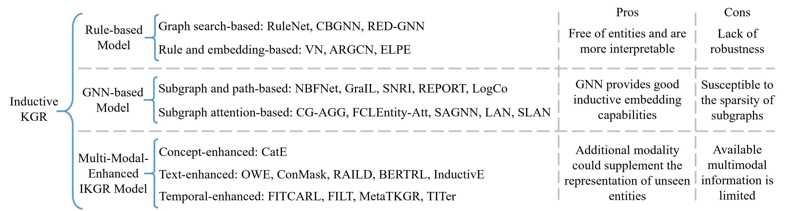

# KGR-Survey
[](https://github.com/ngl567/KGR-Survey)
[](https://github.com/ngl567/KGR-Survey/blob/main/LICENSE)
[](https://arxiv.org/abs/2506.11012)


A Survey of Task-Oriented Knowledge Graph Reasoning: Status, Applications, and Prospects [Paper](https://arxiv.org/pdf/2506.11012)

>**🚀Main contribution of this survey**: This survey provides a more comprehensive perspective on the research of KGR by categorizing approaches based on primary reasoning tasks, downstream application tasks, and potential challenging reasoning tasks. Besides, we explore advanced techniques, such as large language models (LLMs), and their impact on KGR. This work aims to highlight key research trends and outline promising future directions in the field of KGR.

>**🙌Key characteristics of this repository**: Unlike other outstanding review repositories of the knowledge graph reasoning field, we not only provide a comprehensive review but also strive to offer the official publication abstract page for each paper. This includes not only the **official publication version of the paper** but also additional resources such as **author information**, **videos**, **datasets**, **supplementary materials**, and **BibTeX citations**.

If this repository is useful for you, please kindly cite the corresponding survey paper:
```
@article{niu2025kgcsurvey,
      title={A Survey of Task-Oriented Knowledge Graph Reasoning: Status, Applications, and Prospects}, 
      author={Guanglin Niu and Bo Li and Yangguang Lin},
      year={2025},
      journal={CoRR},
      volume={abs/2506.11012}
}
```

The comprehensive overview framework of our survey is presented as following. The same number (①-⑨) indicates that different approaches share similar ideas, and the keywords corresponding to each number are provided at the bottom of the figure.


<details>
   <summary> The illustration of the six primary KGR tasks </summary>
   

</details>

## Content
- [Survey Papers](#survey-papers)
- [Static Single-Step KGR](#single-step-kgr)
- - [KGE-based KGR Model](#kge)
- - - [Translation or Tensor Decomposition-Based KGE Models](#translation)
- - - [(Graph) Neural Network-based Models](#nn-based)
- - - [Transformer-based Models](#transformer-based)
- - - [Ontology-Enhanced KGE Models](#ontology-based)
- - - [Path-Enhanced KGE Models](#path-based)
- - - [Negative Sampling for KGE](#ns)
- - - [Open-Source Library for KGE](#library)
- - [Logic Rule-based KGR Model](#rule-kgr)
- - - [Rule Learning for KG](#rule)
- - - [Neural-Symbolic KGR](#neuro-symbo)
- [Static Multi-Step KGR](#multi-step-kgr)
- - [Random Walk-based Model](#rank-walk)
- - [Reinforcement Learning-based Model](#rl-based)
- - [LLM-based Multi-Step KGR Model](#llm-based)
- [Dynamic KGR](#dynamic-kgr)
- - [Incremental KGE Model](#incremental-kge)
- - [Temporal KGR Model](#temporal-kgr)
- - - [Time Embedding-based Models](#time-embedding)
- - - [Evolution Learning-based Models](#evolution)
- - - [Temporal Rule Learning](#temp-rule)
- - [Multi-step Temporal KGR Model](#multi-step-temp-kgr)
- - [LLM-based Temporal KGR Model](#llm-based-temp)
- [Multi-Modal KGR](#mm-kgr)
- - [Multi-Modal Embedding-based Model](#mm-embedding)
- - [PLM-based Model](#plm-based)
- [Few-Shot KGR](#fs-kgr)
- - [Metric Learning-based Model](#metric-based)
- - [Meta-Learning-based Model](#meta-based)
- - [Auxiliary Information-Enhanced Model](#auxiliary)
- - [Multi-Step Few-Shot KGR Model](#multi-step-fskgr)
- - [Temporal Few-Shot KGR Model](#temp-fskgr)
- [Inductive KGR](#ind-kgr)
- - [Rule-based Model](#rule-based-ind)
- - [GNN-based Model](#gnn-based-ind)
- - [Multimodal-Enhanced Model](#mm-ikgr)
- [Benchmarks](#benckmarks)
- - [Datasets for Static KGR Tasks](#data-static)
- - [Datasets for Dynamic KGR Tasks](#data-dynamic)
- - [Datasets for Multi-modal KGR Tasks](#data-mmkgr)
- - [Datasets for Few-shot KGR Tasks](#data-fskgr)
- - [Datasets for Inductive KGR Tasks](#data-ikgr)
- [Applications](#app)
- - [Question Answering](#qa)
- - [Recommendation](#recom)
- - [Visual Reasoning](#qa)
- - - [Visual Question Answering](#vis-reason)
- - - [Cross-Modal Retrieval](#cross-modal)
- - - [Scene Graph Generation](#scene-graph)
- - [Healthcare Domain](#healthcare)
- - [Business Domain](#business)
- - [Cybersecurity Domain](#cyber-security)
- - [Other Domain](#other-domain)
- [Challenge and Opportunity](#challenge)
- - [Sparse KGR](#sparse)
- - [Uncertain KGR](#uncertain)
- - [KG Error Detection](#error-dection)
- - [Trustworthy KGR](#trust-kgr)
- - [LLM-enhanced KGR](#llm-kgr)

## Survey Papers <span id="survey-papers"></span>
| Title   | Conference/Journal | Year   | Characteristic | Paper |
| ------- | :------: | :-------: | :-------: | :-------: |
| A survey of task-oriented knowledge graph reasoning: status, applications, and prospects | arXiv | 2025  |  Task-oriented KGR | [link](https://arxiv.org/abs/2506.11012)
| Knowledge graph embedding: a survey from the perspective of representation spaces | ACM Computer Survey | 2024  | Embedding Spaces| [link](https://dl.acm.org/doi/abs/10.1145/3643806)
| A survey of knowledge graph reasoning on graph types: Static, dynamic, and multi-modal | IEEE TPAMI | 2024 | Graph Types | [link](https://ieeexplore.ieee.org/document/10577554)
| Negative sampling in knowledge graph representation learning: a review | arXiv | 2024 | Negative Sampling | [link](https://arxiv.org/abs/2402.19195)
| Overview of knowledge reasoning for knowledge graph | Neurocomputering | 2024 | Causal Reasoning | [link](https://www.sciencedirect.com/science/article/abs/pii/S0925231224003424)
| A survey on temporal knowledge graph: representation learning and applications | arXiv | 2024 | Temporal Reasoning | [link](https://arxiv.org/abs/2403.04782)
| A survey on temporal knowledge graph completion: taxonomy, progress, and prospects | arXiv | 2023 | Temporal Reasoning | [link](https://arxiv.org/abs/2308.02457)
| Generalizing to unseen elements: a survey on knowledge extrapolation for knowledge graphs | IJCAI | 2023 | Unseen Elements |[link](https://www.ijcai.org/proceedings/2023/737)
| A survey on few-shot knowledge graph completion with structural and commonsense knowledge | arXiv | 2023 | Commonsense | [link](https://arxiv.org/abs/2301.01172)
| Beyond transduction: a survey on inductive, few shot, and zero shot link prediction in knowledge graphs | arXiv | 2023 | Few-shot & Inductive | [link](https://arxiv.org/abs/2312.04997)
| A comprehensive overview of knowledge graph completion | Knowledge-Based System | 2022 | Multi-modal & Hyper-relation | [link](https://www.sciencedirect.com/science/article/abs/pii/S095070512200805X)
| Knowledgegraph reasoning with logics and embeddings: survey and perspective | arXiv | 2022 | Logics and Embeddings | [link](https://arxiv.org/pdf/2202.07412)

## Static Single-Step KGR <span id="single-step-kgr"></span>
### KGE-based KGR Model <span id="kge"></span>

<details>
   <summary> The illustration of five representative KGE models </summary>
   

</details>

<div align="center"> <span id="translation"></span>
  <h3><strong>Translation or Tensor Decomposition-Based KGE Models</strong></h3>
</div>

| Model  | Title | Conference/Journal | Year | Paper |
|:-----:|---------------------------------|:---------------------------------:|:------:|:------:|
| TransE | Translating embeddings for modeling multi-relational data | NIPS | 2013 | [link](https://proceedings.neurips.cc/paper/2013/hash/1cecc7a77928ca8133fa24680a88d2f9-Abstract.html) |
| TransH | Knowledge graph embedding by translating on hyperplanes | AAAI | 2014 | [link](https://ojs.aaai.org/index.php/AAAI/article/view/8870) |
| TransR | Learning entity and relation embeddings for knowledge graph completion | AAAI | 2015 | [link](https://aaai.org/papers/9491-learning-entity-and-relation-embeddings-for-knowledge-graph-completion/) |
| TransD | Knowledge graph embedding via dynamic mapping matrix | ACL | 2015 | [link](https://doi.org/10.3115/v1/P15-1067) |
| TranSparse | Knowledge graph completion with adaptive sparse transfer matrix | AAAI | 2016 | [link](https://aaai.org/papers/10089-knowledge-graph-completion-with-adaptive-sparse-transfer-matrix/) |
| PairE | PairRE: Knowledge graph embeddings via paired relation vectors | ACL | 2021 | [link](https://doi.org/10.18653/v1/2021.acl-long.336) |
| TransA | TransA: An adaptive approach for knowledge graph embedding | arXiv | 2015 | [link](https://arxiv.org/abs/1509.05490) |
| KG2E | Learning to represent knowledge graphs with Gaussian embedding | CIKM | 2015 | [link](https://doi.org/10.1145/2806416.2806502) |
| ManifoldE | From one point to a manifold: Knowledge graph embedding for precise link prediction | IJCAI | 2016 | [link](https://www.ijcai.org/Proceedings/16/Papers/190.pdf) |
| TorusE | TorusE: Knowledge graph embedding on a Lie group | AAAI | 2018 | [link](https://ojs.aaai.org/index.php/AAAI/article/view/11538) |
| Poincaré | Poincare embeddings for learning hierarchical representations | NIPS | 2017 | [link](https://papers.nips.cc/paper_files/paper/2017/hash/59dfa2df42d9e3d41f5b02bfc32229dd-Abstract.html) |
| MuRP | Multi-relational Poincare graph embeddings | NIPS | 2019 | [link](https://proceedings.neurips.cc/paper_files/paper/2019/file/f8b932c70d0b2e6bf071729a4fa68dfc-Paper.pdf) |
| HAKE | Learning hierarchy-aware knowledge graph embeddings for link prediction | AAAI | 2020 | [link](https://doi.org/10.1609/aaai.v34i03.5701) |
| H2E | Knowledge graph representation via hierarchical hyperbolic neural graph embedding | IEEE Big Data | 2021 | [link](https://doi.org/10.1109/BigData52589.2021.9671651) |
| HBE | Hyperbolic hierarchy-aware knowledge graph embedding for link prediction | EMNLP | 2021 | [link](https://doi.org/10.18653/v1/2021.findings-emnlp.251) |
| RotatE | RotatE: Knowledge graph embedding by relational rotation in complex space | ICLR | 2019 | [link](https://arxiv.org/pdf/1902.10197) |
| QuatE | Quaternion knowledge graph embedding | NIPS | 2019 | [link](https://proceedings.neurips.cc/paper_files/paper/2019/file/d961e9f236177d65d21100592edb0769-Paper.pdf) |
| DualE | Dual quaternion knowledge graph embeddings | AAAI | 2021 | [link](https://doi.org/10.1609/aaai.v35i8.16850) |
| RESCAL | A three-way model for collective learning on multi-relational data | ICML | 2011 | [link](https://icml.cc/2011/papers/438_icmlpaper.pdf) |
| PITF-BPR | Predicting RDF triples in incomplete knowledge bases with tensor factorization | SAC | 2012 | [link](https://doi.org/10.1007/978-3-319-25007-6_37) |
| DistMult | Embedding entities and relations for learning and inference in knowledge bases | ICLR | 2015 | [link](https://arxiv.org/pdf/1412.6575) |
| ComplEx | Complex embeddings for simple link prediction | ICML | 2016 | [link](https://arxiv.org/pdf/1606.06357) |
| HolE | Holographic embeddings of knowledge graphs | AAAI | 2016 | [link](https://ojs.aaai.org/index.php/AAAI/article/view/10314) |

<div align="center"> <span id="nn-based"></span>
  <h3><strong>(Graph) Neural Network-based Models</strong></h3>
</div>

| Model  | Title | Conference/Journal | Year | Paper |
|:-----:|---------------------------------|:---------------------------------:|:------:|:------:|
| NTN  | Reasoning with neural tensor networks for knowledge base completion | NIPS | 2013 | [link](https://proceedings.neurips.cc/paper_files/paper/2013/hash/b337e84de8752b27eda3a12363109e80-Abstract.html) |
| SME | A semantic matching energy function for learning with multi-relational data | Machine Learning | 2014 | [link](https://doi.org/10.1007/s10994-013-5363-6) |
| NAM | Probabilistic reasoning via deep learning: Neural association models | arXiv | 2016 | [link](https://arxiv.org/abs/1603.07704) |
| ConvE | Convolutional 2D knowledge graph embeddings | AAAI | 2018 | [link](https://ojs.aaai.org/index.php/AAAI/article/view/11573) |
| ConvKB | A novel embedding model for knowledge base completion based on convolutional neural network | NAACL | 2018 | [link](https://doi.org/10.18653/v1/N18-2053) |
| GNN Survey | A comprehensive survey on graph neural networks | IEEE TNNLS | 2021 | [link](https://doi.org/10.1109/TNNLS.2020.2978386) |
| R-GCN | Modeling relational data with graph convolutional networks | ESWC | 2018 | [Link](https://doi.org/10.1007/978-3-319-93417-4_38) |
| SACN | End-to-end structure-aware convolutional networks for knowledge base completion | AAAI | 2019 | [link](https://ojs.aaai.org/index.php/AAAI/article/view/4164) |
| KBGAT | Learning attention-based embeddings for relation prediction in knowledge graphs | ACL | 2019 | [link](https://doi.org/10.18653/v1/P19-1466) |
| KE-GCN | Knowledge embedding based graph convolutional network | The Web Conference | 2021 | [link](https://doi.org/10.1145/3442381.3449925) |

<div align="center"> <span id="transformer-based"></span>
  <h3><strong>Transformer-based Models</strong></h3>
</div>

| Model  | Title | Conference/Journal | Year | Paper |
|:-----:|---------------------------------|:---------------------------------:|:------:|:------:|
| KG-BERT | Modeling relational data with graph convolutional networks | ESWC | 2018 | [Link](https://doi.org/10.1007/978-3-319-93417-4_38) |
| R-MeN | A relational memory-based embedding model for triple classification and search personalization | ACL | 2021 | [link](https://aclanthology.org/2020.acl-main.313/) |
| CoKE | CoKE: Contextualized knowledge graph embedding | arXiv | 2019 | [link](https://arxiv.org/abs/1911.02168) |
| HittER | HittER: Hierarchical transformers for knowledge graph embeddings | EMNLP | 2021 | [link](https://aclanthology.org/2021.emnlp-main.812/) |
| GenKGC | From discrimination to generation: Knowledge graph completion with generative transformer | WWW | 2022 | [link](https://doi.org/10.1145/3487553.3524238) |
| iHT | Pre-training transformers for knowledge graph completion | arXiv | 2023 | [link](https://arxiv.org/abs/2303.15682) |
| SimKGC | SimKGC: Simple contrastive knowledge graph completion with pre-trained language models | ACL | 2022 | [link](https://doi.org/10.18653/v1/2022.acl-long.295) |
| StAR | Structure-augmented text representation learning for efficient knowledge graph completion | WWW | 2021 | [link](https://doi.org/10.1145/3442381.3450043) |
| KoPA | Making large language models perform better in knowledge graph completion | arXiv | 2023 | [link](https://arxiv.org/abs/2310.06671) |
| KICGPT | KICGPT: Large language model with knowledge in context for knowledge graph completion | EMNLP | 2023 | [link](https://doi.org/10.18653/v1/2023.findings-emnlp.580) |
| Relphormer | Relphormer: Relational graph transformer for knowledge graph representations | Neurocomputing | 2024 | [link](https://doi.org/10.1016/j.neucom.2023.127044) |
| LGKGR | LGKGR: A knowledge graph reasoning model using LLMs augmented GNNs | Neurocomputing | 2025 | [Link](https://doi.org/10.1016/j.neucom.2025.129919) |

<div align="center"> <span id="ontology-based"></span>
  <h3><strong>Ontology-Enhanced KGE Models</strong></h3>
</div>

| Model  | Title | Conference/Journal | Year | Paper |
|:-----:|---------------------------------|:---------------------------------:|:------:|:------:|
| JOIE  | Universal representation learning of knowledge bases by jointly embedding instances and ontological concepts | KDD | 2019 | [Link](https://doi.org/10.1145/3292500.3330838) |
| Nickel et al. | Factorizing YAGO: Scalable machine learning for linked data | WWW | 2012 | [link](https://doi.org/10.1145/2187836.2187874) |
| CISS | Embedding two-view knowledge graphs with class inheritance and structural similarity | KDD | 2024 | [link](https://doi.org/10.1145/3637528.3671941) |
| Wang et al. | An ontology-enhanced knowledge graph embedding method | ICCPR | 2024 | [link](https://doi.org/10.1145/3633637.3633645) |
| Concept2Box | Concept2Box: Joint geometric embeddings for learning two-view knowledge graphs | ACL | 2023 | [link](https://doi.org/10.18653/v1/2023.findings-acl.642) |
| CAKE | CAKE: A scalable commonsense-aware framework for multi-view knowledge graph completion | ACL | 2022 | [link](https://doi.org/10.18653/v1/2022.acl-long.205) |
| SSE | Semantically smooth knowledge graph embedding | ACL | 2015 | [link](https://doi.org/10.3115/v1/P15-1009) |
| TKRL | Representation learning of knowledge graphs with hierarchical types | IJCAI | 2016 | [link](https://www.ijcai.org/Proceedings/16/Papers/421.pdf) |
| TransET | TransET: Knowledge graph embedding with entity types | Electronics | 2021 | [link](https://doi.org/10.3390/electronics10121407) |
| AutoETER | AutoETER: Automated entity type representation for knowledge graph embedding | EMNLP | 2020 | [link](https://doi.org/10.18653/v1/2020.findings-emnlp.105) |

<div align="center"> <span id="path-based"></span>
  <h3><strong>Path-Enhanced KGE Models</strong></h3>
</div>

| Model  | Title | Conference/Journal | Year | Paper |
|:-----:|---------------------------------|:---------------------------------:|:------:|:------:|
| Path-RNN | Compositional vector space models for knowledge base completion | ACL | 2015 | [link](https://doi.org/10.3115/v1/P15-1016) |
| PTransE  | Modeling relation paths for representation learning of knowledge bases | EMNLP | 2015 | [Link](https://doi.org/10.18653/v1/D15-1082) |
| PRN | A path-based relation networks model for knowledge graph completion | Expert Systems with Applications | 2021 | [link](https://doi.org/10.1016/j.eswa.2021.115273) |
| OPTransE | Representation learning with ordered relation paths for knowledge graph completion | EMNLP-IJCNLP | 2019 | [link](https://doi.org/10.18653/v1/D19-1268) |
| TransE\&RW | Modeling relation paths for knowledge base completion via joint adversarial training | Knowledge Based Systems | 2020 | [link](https://doi.org/10.1016/j.knosys.2020.105865) |
| HARPA | HARPA: hierarchical attention with relation paths for knowledge graph embedding adversarial learning | Data Mining and Knowledge Discovery | 2023 | [link](https://doi.org/10.1007/s10618-022-00888-3) |
| RPJE | Rule-guided compositional representation learning on knowledge graphs | AAAI | 2020 | [link](https://doi.org/10.1609/aaai.v34i03.5687) |
| PARL | Attention-aware path-based relation extraction for medical knowledge graph | Smart Computing and Communication | 2017 | [link](https://doi.org/10.1007/978-3-319-73830-7_32) |
| Das et al. | Chains of reasoning over entities, relations, and text using recurrent neural networks | EACL | 2017 | [link](https://aclanthology.org/E17-1013/) |
| Jiang et al. | Attentive path combination for knowledge graph completion | Machine Learning Research | 2017 | [link](https://proceedings.mlr.press/v77/jiang17a.html) |
| CPConvKE | A confidence-aware and path-enhanced convolutional neural network embedding framework on noisy knowledge graph | Neurocomputing | 2023 | [link](https://doi.org/10.1016/j.neucom.2023.126261) |
| PaSKoGE | Path-specific knowledge graph embedding | Knowledge-based Systems | 2018 | [link](https://doi.org/10.1016/j.knosys.2018.03.020) |
| Jagvaral et al. | Path-based reasoning approach for knowledge graph completion using CNN-BiLSTM with attention mechanism | Expert Systems with Applications | 2020 | [link](https://doi.org/10.1016/j.eswa.2019.112960) |
| PathCon | Relational message passing for knowledge graph completion | KDD | 2021 | [link](https://doi.org/10.1145/3447548.3467247) |
| PTrustE | PTrustE: A high-accuracy knowledge graph noise detection method based on path trustworthiness and triple embedding | Knowledge-based Systems | 2022 | [link](https://doi.org/10.1016/j.knosys.2022.109688) |
| TAPR | Modeling relation paths for knowledge graph completion | IEEE TKDE | 2021 | [link](https://doi.org/10.1109/TKDE.2020.2970044) |
| Niu et al. | Joint semantics and data-driven path representation for knowledge graph reasoning | Neurocomputing | 2022 | [link](https://doi.org/10.1016/j.neucom.2022.02.011) |

<div align="center"> <span id="ns"></span>
  <h3><strong>Negative Sampling for KGE</strong></h3>
</div>

<details>
   <summary> The illustration of six types of negative sampling strategies </summary>
   

</details>

| Model  | Title | Conference/Journal | Year | Paper |
|:-----:|---------------------------------|:---------------------------------:|:------:|:------:|
| Local Closed-World Assumption | Knowledge Vault: A web scale approach to probabilistic knowledge fusion | KDD | 2014 | [link](https://doi.org/10.1145/2623330.2623623) |
| NS Survey | Negative sampling in knowledge graph representation learning: A review | arXiv | 2023 | [link](https://arxiv.org/abs/2301.12345) |
| Uniform Sampling | Knowledge graph embedding by translating on hyperplanes | AAAI | 2014 | [link](https://ojs.aaai.org/index.php/AAAI/article/view/8870) |
| KBGAN  | KBGAN: Adversarial learning for knowledge graph embeddings | NAACL | 2018 | [Link](https://doi.org/10.18653/v1/N18-1133) |
| Self-Adv | RotatE: Knowledge graph embedding by relational rotation in complex space | ICLR | 2019 | [link](https://arxiv.org/pdf/1902.10197) |
| Batch NS | Pytorch-BigGraph: A large scale graph embedding system | Machine Learning and Systems | 2019 | [link](https://proceedings.mlsys.org/paper_files/paper/2019/hash/1eb34d662b67a14e3511d0dfd78669be-Abstract.html) |
| Bernoulli NS | An interpretable knowledge transfer model for knowledge base completion | ACL | 2017 | [link](https://doi.org/10.18653/v1/P17-1088) |
| Zhang et al. | A novel negative sample generating method for knowledge graph embedding | EWSN | 2019 | [link](https://www.ewsn.org/file-repository/ewsn2019/401_406_zhang.pdf) |
| SparseNSG | A novel negative sampling based on frequency of relational association entities for knowledge graph embedding | Journal of Web Engineering | 2021 | [link](https://doi.org/10.13052/jwe1540-9589.2068) |
| IGAN | Incorporating GAN for negative sampling in knowledge representation learning | AAAI | 2018 | [link](https://ojs.aaai.org/index.php/AAAI/article/view/11536) |
| GraphGAN | GraphGAN: Graph representation learning with generative adversarial nets | AAAI | 2018 | [link](https://ojs.aaai.org/index.php/AAAI/article/view/11872) |
| KSGAN | A knowledge selective adversarial network for link prediction in knowledge graph | NLPCC | 2019 | [link](https://doi.org/10.1007/978-3-030-32233-5_14) |
| RUGA | Improving knowledge graph completion using soft rules and adversarial learning | Chinese Journal of Electronics | 2021 | [link](https://doi.org/10.1049/cje.2021.05.004) |
| LAS | Adversarial knowledge representation learning without external model | IEEE Access | 2019 | [link](https://doi.org/10.1109/ACCESS.2018.2889481) |
| ASA | Relation-aware graph attention model with adaptive self-adversarial training | AAAI | 2021 | [link](https://ojs.aaai.org/index.php/AAAI/article/view/17129) |
| AN | Knowledge graph embedding based on adaptive negative sampling | ICPSEE | 2019 | [link](https://doi.org/10.1007/978-981-15-0118-0_42) |
| EANS | Entity aware negative sampling with auxiliary loss of false negative prediction for knowledge graph embedding | arXiv | 2022 | [link](https://arxiv.org/abs/2210.06242) |
| Truncated NS | Fusing attribute character embeddings with truncated negative sampling for entity alignment | Electronics | 2023 | [link](https://doi.org/10.3390/electronics12081947) |
| DNS | Distributional negative sampling for knowledge base completion | arXiv | 2019 | [link](https://arxiv.org/abs/1908.06178) |
| ESNS | Entity similarity-based negative sampling for knowledge graph embedding | PRICAI | 2022 | [Link](https://doi.org/10.1007/978-3-031-20865-2_6) |
| RCWC | KGBoost: A classification-based knowledge base completion method with negative sampling | Pattern Recognition Letters | 2022 | [link](https://www.sciencedirect.com/science/article/abs/pii/S0167865522000939) |
| Conditional Sampling | Conditional constraints for knowledge graph embeddings | DL4KG | 2020 | [link](https://ceur-ws.org/Vol-2635/paper3.pdf) |
| LEMON | LEMON: LanguagE MOdel for negative sampling of knowledge graph embeddings | arXiv preprint | 2022 | [Link](https://arxiv.org/abs/2203.04703) |
| NSCaching | NSCaching: Simple and efficient negative sampling for knowledge graph embedding | ICDE | 2019 | [Link](https://doi.org/10.1109/ICDE.2019.00061) |
| MDNcaching | MDNcaching: A strategy to generate quality negatives for knowledge graph embedding | IEA/AIE | 2022 | [Link](https://doi.org/10.1007/978-3-031-08530-7_74) |
| Op-Trans | Op-Trans: An optimization framework for negative sampling and triplet-mapping properties in knowledge graph embedding | Applied Sciences | 2023 | [Link](https://doi.org/10.3390/app13052817) |
| NS-KGE | Efficient non-sampling knowledge graph embedding | The Web Conference | 2021 | [Link](https://doi.org/10.1145/3442381.3449859) |

<div align="center"> <span id="library"></span>
  <h3><strong>Open-Source Library for KGE</strong></h3>
</div>

| Library | Implementation | Key Features | GitHub Repository |
|:---:|:---:|---|---|
| OpenKE | Pytorch, TensorFlow, C++ | Efficiently implements fundamental operations such as data loading, negative sampling, and performance evaluation using C++ for high performance. | [https://github.com/thunlp/OpenKE](https://github.com/thunlp/OpenKE) |
| AmpliGraph | TensorFlow | Provides a Keras-style API with improved efficiency over OpenKE. | [https://github.com/Accenture/AmpliGraph](https://github.com/Accenture/AmpliGraph) |
| torchKGE | Pytorch | Achieves twice the efficiency of OpenKE and five times that of AmpliGraph. | [https://github.com/torchkge-team/torchkge](https://github.com/torchkge-team/torchkge) |
| LibKGE | Pytorch | Enables direct configuration of hyperparameters and model settings via configuration files. | [https://github.com/uma-pi1/kge](https://github.com/uma-pi1/kge) |
| KB2E | C++ | One of the earliest KGE libraries and the predecessor of OpenKE. | [https://github.com/thunlp/KB2E](https://github.com/thunlp/KB2E) |
| scikit-kge | Python | Implements multiple classical KGE models and supports a novel negative sampling strategy. | [https://github.com/mnick/scikit-kge](https://github.com/mnick/scikit-kge) |
| NeuralKG | Pytorch | Integrates KGE techniques with graph neural networks (GNNs) and rule-based reasoning models. | [https://github.com/zjukg/NeuralKG](https://github.com/zjukg/NeuralKG) |
| PyKEEN | Pytorch | Offers 37 datasets, 40 KGE models, 15 loss functions, 6 regularization mechanisms, and 3 negative sampling strategies. | [https://github.com/pykeen/pykeen](https://github.com/pykeen/pykeen) |
| Pykg2vec | Pytorch, TensorFlow | Supports automated hyperparameter tuning, exports KG embeddings in TSV or RDF formats, and provides visualization for performance evaluation. | [https://github.com/Sujit-O/pykg2vec](https://github.com/Sujit-O/pykg2vec) |
| μKG | Pytorch, TensorFlow | Supports multi-process execution and GPU-accelerated computation, making it well-suited for large-scale KGs. | [https://github.com/nju-websoft/muKG](https://github.com/nju-websoft/muKG) |
| DGL-KE | Pytorch, MXNet | Optimized for execution on CPU and GPU clusters, offering high scalability for large-scale KGs. | [https://github.com/awslabs/dgl-ke](https://github.com/awslabs/dgl-ke) |
| GraphVite | Pytorch | Provides efficient large-scale embedding learning, supports visualization of graph data, and enables multi-processing and GPU parallelization. | [https://github.com/DeepGraphLearning/graphvite](https://github.com/DeepGraphLearning/graphvite) |
| PBG | Pytorch | Designed for distributed training, capable of handling KGs with billions of entities and trillions of edges. | [https://github.com/facebookresearch/PyTorch-BigGraph](https://github.com/facebookresearch/PyTorch-BigGraph) |

### Logic Rule-based KGR Model <span id="rule-kgr"></span>

<div align="center"> <span id="rule"></span>
  <h3><strong>Rule Learning for KG</strong></h3>
</div>

| Model  | Title | Conference/Journal | Year | Paper |
|:-----:|---------------------------------|:---------------------------------:|:------:|:------:|
| FOIL | Learning logical definitions from relations | Machine Learning | 1990 | [link](https://doi.org/10.1023/A:1022699322624) |
| MDIE | Inverse entailment and progol | New Generation Computing | 1995 | [link](https://doi.org/10.1007/BF03037227) |
| Inspire | Best-effort inductive logic programming via fine-grained cost-based hypothesis generation | Machine Learning | 2018 | [link](https://doi.org/10.1007/s10994-018-5708-2) |
| Neural-Num-LP | Differentiable learning of numerical rules in knowledge graphs | ICLR | 2020 | [link](https://openreview.net/pdf?id=rJleKgrKwS) |
| AMIE+ | Fast rule mining in ontological knowledge bases with AMIE+ | VLDB Journal | 2015 | [link](https://doi.org/10.1007/s00778-015-0394-1) |
| ScaLeKB | ScaLeKB: Scalable learning and inference over large knowledge bases | VLDB Journal | 2016 | [link](https://doi.org/10.1007/s00778-016-0444-3) |
| RDF2rules | RDF2Rules: Learning rules from RDF knowledge bases by mining frequent predicate cycles | arXiv | 2015 | [link](https://arxiv.org/abs/1512.07734) |
| SWARM | SWARM: An approach for mining semantic association rules from semantic web data | PRICAI | 2016 | [link](https://doi.org/10.1007/978-3-319-42911-3_3) |
| Rudik | Rudik: Rule discovery in knowledge bases | PVLDB | 2018 | [link](https://doi.org/10.14778/3229863.3236231) |
| RuLES | Rule learning from knowledge graphs guided by embedding models | ESWC | 2018 | [link](https://doi.org/10.1007/978-3-030-00671-6_5) |
| Evoda | Rule learning over knowledge graphs with genetic logic programming | ICDE | 2022 | [link](https://doi.org/10.1109/ICDE53745.2022.00318) |
| NeuralLP | Differentiable learning of logical rules for knowledge base reasoning | NeurIPS | 2017 | [link](https://proceedings.neurips.cc/paper/2017/file/0e55666a4ad822e0e34299df3591d979-Paper.pdf) |
| DRUM | DRUM: End-to-end differentiable rule mining on knowledge graphs | NeurIPS | 2019 | [link](https://proceedings.neurips.cc/paper_files/paper/2019/file/0c72cb7ee1512f800abe27823a792d03-Paper.pdf) |
| RLvLR | An embedding-based approach to rule learning in knowledge graphs | IEEE TKDE | 2019 | [link](https://doi.org/10.1109/TKDE.2019.2941685) |
| RNNLogic | RNNLogic: learning logic rules for reasoning on knowledge graphs | ICLR | 2021 | [link](https://arxiv.org/pdf/2010.04029) |
| RARL | Relatedness and TBox-driven rule learning in large knowledge bases | AAAI | 2020 | [link](https://ojs.aaai.org/index.php/AAAI/article/view/5690/) |
| Ruleformer | Ruleformer: context-aware rule mining over knowledge graph | COLING | 2022 | [link](https://aclanthology.org/2022.coling-1.225/) |
| Ott et al. | Rule-based knowledge graph completion with canonical models | CIKM | 2023 | [link](https://doi.org/10.1145/3583780.3615042) |

<div align="center"> <span id="neuro-symbo"></span>
  <h3><strong>Neural-Symbolic KGR</strong></h3>
</div>

| Model  | Title | Conference/Journal | Year | Paper |
|:-----:|---------------------------------|:---------------------------------:|:------:|:------:|
| KALE | Jointly embedding knowledge graphs and logical rules | EMNLP | 2016 | [link](https://doi.org/10.18653/v1/D16-1019) |
| RUGE | Knowledge graph embedding with iterative guidance from soft rules | AAAI | 2018 | [link](https://ojs.aaai.org/index.php/AAAI/article/view/11918) |
| RulE | RulE: Knowledge graph reasoning with rule embedding | Findings of ACL | 2024 | [link](https://doi.org/10.18653/v1/2024.findings-acl.256) |
| RPJE | Rule-guided compositional representation learning on knowledge graphs | AAAI | 2020 | [link](https://doi.org/10.1609/aaai.v34i03.5687) |
| IterE | Iteratively learning embeddings and rules for knowledge graph reasoning | WWW | 2019 | [link](https://doi.org/10.1145/3308558.3313612) |
| UniKER | UniKER: A unified framework for combining embedding and definite Horn rule reasoning for knowledge graph inference | EMNLP | 2021 | [link](https://doi.org/10.18653/v1/2021.emnlp-main.769) |
| EngineKG | Perform like an engine: A closed-loop neural-symbolic learning framework for knowledge graph inference | COLING | 2022 | [link](https://aclanthology.org/2022.coling-1.119/) |

<details>
   <summary> Taxonomy of static single-step KGR approaches </summary>
   

</details>

## Static Multi-Step KGR <span id="multi-step-kgr"></span>

### Random Walk-based Model <span id="rank-walk"></span>

| Model  | Title | Conference/Journal | Year | Paper |
|:-----:|---------------------------------|:---------------------------------:|:------:|:------:|
| PRA | Relational retrieval using a combination of path-constrained random walks | *Machine Learning* | 2010 | [link](https://doi.org/10.1007/s10994-010-5205-8) |
| Lao et al. 1 | Random walk inference and learning in a large scale knowledge base | EMNLP | 2011 | [link](https://aclanthology.org/D11-1049/) |
| Lao et al. 2 | Reading the web with learned syntactic-semantic inference rules | EMNLP | 2012 | [link](https://aclanthology.org/D12-1093/) |
| Gardner et al. | Improving learning and inference in a large knowledge-base using latent syntactic cues | EMNLP | 2013 | [link](https://doi.org/10.18653/v1/D15-1173) |
| CPRA | Knowledge base completion via coupled path ranking | ACL | 2016 | [link](https://doi.org/10.18653/v1/P16-1124) |
| C-PR | Context-aware path ranking for knowledge base completion | IJCAI | 2017 | [link](https://www.ijcai.org/Proceedings/2017/166) |
| A\*Net | A\*Net: a scalable path-based reasoning approach for knowledge graphs | NeurIPS | 2024 | [link](https://proceedings.neurips.cc/paper_files/paper/2023/hash/b9e98316cb72fee82cc1160da5810abc-Abstract-Conference.html) |
| SFE | Efficient and expressive knowledge base completion using subgraph feature extraction | EMNLP | 2015 | [link](https://doi.org/10.18653/v1/D15-1173) |
| PathCon | Relational message passing for knowledge graph completion | KDD | 2021 | [link](https://doi.org/10.1145/3447548.3467247) |

### Reinforcement Learning-based Model <span id="rl-based"></span>

| Model  | Title | Conference/Journal | Year | Paper |
|:-----:|---------------------------------|:---------------------------------:|:------:|:------:|
| DeepPath   | DeepPath: a reinforcement learning method for knowledge graph reasoning | EMNLP | 2017 | [link](https://doi.org/10.18653/v1/D17-1060) |
| MINERVA | Go for a walk and arrive at the answer: Reasoning over paths in knowledge bases using reinforcement learning | ICLR | 2018 | [link](https://www.akbc.ws/2017/papers/24_paper.pdf) |
| DIVA  | Variational knowledge graph reasoning | NAACL | 2018 | [link](https://doi.org/10.18653/v1/N18-1165) |
| MultiHopKG  | Multi-hop knowledge graph reasoning with reward shaping | EMNLP | 2018 | [link](https://doi.org/10.18653/v1/D18-1362) |
| M-Walk  | M-Walk: Learning to walk over graphs using monte carlo tree search | NeurIPS | 2018 | [link]() |
| RARL  | Rule-aware reinforcement learning for knowledge graph reasoning | ACL-IJCNLP | 2021 | [link](https://doi.org/10.18653/v1/2021.findings-acl.412) |
| AttnPath  | Incorporating graph attention mechanism into knowledge graph reasoning based on deep reinforcement learning | EMNLP-IJCNLP | 2019 | [link](https://doi.org/10.18653/v1/D19-1264) |
| DIVINE  | DIVINE: A generative adversarial imitation learning framework for knowledge graph reasoning | EMNLP-IJCNLP | 2019 | [link](https://doi.org/10.18653/v1/D19-1266) |

### LLM-based Multi-Step KGR Model <span id="llm-based"></span>

| Model  | Title | Conference/Journal | Year | Paper |
|:-----:|---------------------------------|:---------------------------------:|:------:|:------:|
| KG\&LLM Survey | Unifying large language models and knowledge graphs: A roadmap | IEEE TKDE | 2024 | [link](https://doi.org/10.1109/TKDE.2024.3352100) |
| StructGPT | StructGPT: A general framework for large language model to reason over structured data | EMNLP | 2023 | [link](https://doi.org/10.18653/v1/2023.emnlp-main.574) |
| KSL | Knowledge solver: Teaching LLMs to search for domain knowledge from knowledge graphs | arXiv | 2023 | [link](https://arxiv.org/abs/2309.03118) |
| KD-CoT | Knowledge-driven CoT: Exploring faithful reasoning in LLMs for knowledge-intensive question answering | arXiv | 2023 | [link](https://arxiv.org/abs/2308.13259) |
| ToG | Think-on-Graph: Deep and responsible reasoning of large language model on knowledge graph | ICLR | 2024 | [link](https://arxiv.org/pdf/2307.07697) |
| KnowledgeNavigator | KnowledgeNavigator: Leveraging large language models for enhanced reasoning over knowledge graph | Complex Intell. Syst. | 2024 | [link](https://doi.org/10.1007/s40747-024-01527-8) |
| Nguyen et al. | Direct evaluation of chain-of-thought in multi-hop reasoning with knowledge graphs | Findings of ACL | 2024 | [link](https://doi.org/10.18653/v1/2024.findings-acl.168) |
| KG-Agent | KG-Agent: An efficient autonomous agent framework for complex reasoning over knowledge graph | arXiv | 2024 | [link](https://arxiv.org/abs/2402.11163) |
| AgentTuning | AgentTuning: Enabling generalized agent abilities for LLMs | Findings of ACL | 2024 | [link](https://doi.org/10.18653/v1/2024.findings-acl.181) |
| Glam | Glam: Fine-tuning large language models for domain knowledge graph alignment via neighborhood partitioning and generative subgraph encoding | AAAI Symposium | 2024 | [link](https://ojs.aaai.org/index.php/AAAI-SS/article/view/31186) |

<details>
   <summary> Taxonomy of static multi-step KGR approaches </summary>
   

</details>

## Dynamic KGR <span id="dynamic-kgr"></span>

<details>
   <summary> The illustration of the dynamic KGR task </summary>
   

</details>

### Incremental KGE Model <span id="incremental-kge"></span>

| Model  | Title | Conference/Journal | Year | Paper |
|:-----:|---------------------------------|:---------------------------------:|:------:|:------:|
| DKGE | Efficiently embedding dynamic knowledge graphs | Knowl.-Based Syst. | 2022 | [link](https://doi.org/10.1016/j.knosys.2022.109124) |
| PuTransE | Non-parametric estimation of multiple embeddings for link prediction on dynamic knowledge graphs | AAAI | 2017 | [link](https://doi.org/10.1609/aaai.v31i1.10685) |
| Liu et al. | Heuristic-driven, type-specific embedding in parallel spaces for enhancing knowledge graph reasoning | ICASSP | 2024 | [link]() |
| ABIE | Anchors-based incremental embedding for growing knowledge graphs | TKDE | 2023 | [link](https://doi.org/10.1109/TKDE.2021.3136482) |
| CKGE | Towards continual knowledge graph embedding via incremental distillation | AAAI | 2024 | [link](https://doi.org/10.1609/aaai.v38i8.28722) |
| LKGE | Lifelong embedding learning and transfer for growing knowledge graphs | AAAI | 2023 | [link](https://doi.org/10.1609/aaai.v37i4.25539) |
| AIR | AIR: Adaptive incremental embedding updating for dynamic knowledge graphs | DASFAA | 2023 | [link](https://doi.org/10.1007/978-3-031-30672-3_41) |
| TIE | TIE: A framework for embedding-based incremental temporal knowledge graph completion | SIGIR | 2021 | [link](https://doi.org/10.1145/3404835.3462961) |
| RotatH | Incremental update of knowledge graph embedding by rotating on hyperplanes | ICWS | 2021 | [link](https://doi.org/10.1109/ICWS53863.2021.00072) |
| MMRotatH | Knowledge graph incremental embedding for unseen modalities | Knowl. Inf. Syst. | 2023 | [link](https://doi.org/10.1007/s10115-023-01868-9) |
| DKGE | Efficiently embedding dynamic knowledge graphs | Knowl.-Based Syst. | 2022 | [link](https://doi.org/10.1016/j.knosys.2022.109124) |
| Navi | Dynamic knowledge graph embeddings via local embedding reconstructions | ESWC (Satellite) | 2022 | [link](https://doi.org/10.1007/978-3-031-11609-4_36) |
| UOKE | Online updates of knowledge graph embedding | Complex Networks X | 2021 | [link](https://doi.org/10.1007/978-3-030-93413-2_44) |
| 257 | Temporal knowledge graph incremental construction model for recommendation | APWeb-WAIM | 2020 | [link](https://doi.org/10.1007/978-3-030-60259-8_26) |

### Temporal KGR Model <span id="temporal-kgr"></span>

<div align="center"> <span id="time-embedding"></span>
  <h3><strong>Time Embedding-based Models</strong></h3>
</div>

| Model  | Title | Conference/Journal | Year | Paper |
|:-----:|---------------------------------|:---------------------------------:|:------:|:------:|
| TA-TransE   | Learning sequence encoders for temporal knowledge graph completion | EMNLP | 2018 | [link](https://doi.org/10.18653/v1/D18-1516) |
| HyTE   | HyTE: Hyperplane-based temporally aware knowledge graph embedding | EMNLP | 2018 | [link](https://doi.org/10.18653/v1/D18-1225) |
| TTransE  | Deriving validity time in knowledge graph | WWW | 2018 | [link](https://dl.acm.org/doi/pdf/10.1145/3184558.3191639) |
| TERO  | TeRo: A time-aware knowledge graph embedding via temporal rotation | COLING | 2020 | [link](https://doi.org/10.18653/v1/2020.coling-main.139) |
| TDistMult  | Embedding models for episodic knowledge graphs | JWS | 2019 | [link](https://doi.org/10.1016/j.websem.2018.12.008) |
| TComplEx  | Tensor decompositions for temporal knowledge base completion | ICLR | 2020 | [link](https://arxiv.org/pdf/2004.04926) |
| SimplE  | Diachronic embedding for temporal knowledge graph completion | AAAI | 2020 | [link](https://ojs.aaai.org/index.php/AAAI/article/view/5815) |
| ATiSE  | Temporal KGC based on time series gaussian embedding | ISWC | 2020 | [link](https://doi.org/10.1007/978-3-030-62419-4_37) |
| TARGAT  | TARGAT: A time-aware relational graph attention model | IEEE/ACM TASLP | 2023 | [link](https://doi.org/10.1109/TASLP.2023.3282101) |
| LCGE  | Logic and commonsense-guided TKGC | AAAI | 2023 | [link](https://doi.org/10.1609/aaai.v37i4.25579) |

<div align="center"> <span id="evolution"></span>
  <h3><strong>Evolution Learning-based Models</strong></h3>
</div>

| Model  | Title | Conference/Journal | Year | Paper |
|:-----:|---------------------------------|:---------------------------------:|:------:|:------:|
| Know-Evolve  | Know-evolve: deep temporal reasoning for dynamic knowledge graphs | ICML  | 2017 | [link](https://proceedings.mlr.press/v70/trivedi17a.html) |
| RE-NET  | Recurrent event network: autoregressive structure inference over temporal knowledge graphs | EMNLP | 2020 | [link](https://aclanthology.org/2020.emnlp-main.541/) |
| EvolveRGCN | EvolveGCN: Evolving Graph Convolutional Networks for Dynamic Graphs | AAAI | 2020 | [link](https://arxiv.org/abs/1902.10191)
| CyGNet  | Learning from history: modeling temporal knowledge graphs with sequential copy-generation networks | AAAI  | 2021 | [link](https://ojs.aaai.org/index.php/AAAI/article/view/16604) |
| CluSTeR  | Search from history and reason for future: two-stage reasoning on temporal knowledge graphs | ACL   | 2021 | [link](https://aclanthology.org/2021.acl-long.365/) |

<div align="center"> <span id="temp-rule"></span>
  <h3><strong>Temporal Rule Learning</strong></h3>
</div>

| Model  | Title | Conference/Journal | Year | Paper |
|:-----:|---------------------------------|:---------------------------------:|:------:|:------:|
| StreamLearner | Learning temporal rules from knowledge graph streams | AAAI Spring Symposium | 2019 | [link](https://dl.acm.org/doi/10.1145/3437963.3441741) |
| Tlogic | Tlogic: temporal logical rules for explainable link forecasting on temporal knowledge graphs | AAAI | 2022 | [link](https://doi.org/10.1609/aaai.v36i4.20330) |
| TILP | TILP: differentiable learning of temporal logical rules on knowledge graphs | ICLR | 2023 | [link](https://arxiv.org/pdf/2402.12309) |
| TEILP | TEILP: time prediction over knowledge graphs via logical reasoning | AAAI | 2024 | [link](https://ojs.aaai.org/index.php/AAAI/article/view/29544) |
| NeuSTIP | NeuSTIP: a neuro-symbolic model for link and time prediction in temporal knowledge graphs | EMNLP | 2023 | [link](https://doi.org/10.18653/v1/2023.emnlp-main.274) |

### Multi-step Temporal KGR Model <span id="multi-step-temp-kgr"></span>

| Model  | Title | Conference/Journal | Year | Paper |
|:-----:|---------------------------------|:---------------------------------:|:------:|:------:|
| xERTE  | Explainable subgraph reasoning for forecasting on temporal knowledge graphs | ICLR | 2021 | [link](https://iclr.cc/virtual/2021/poster/3378) |
| CluSTeR | Search from history and reason for future: two-stage reasoning on temporal knowledge graphs | ACL | 2021 | [link](https://aclanthology.org/2021.acl-long.365/) |
| TPath | Multi-hop reasoning over paths in temporal knowledge graphs using reinforcement learning | Applied Soft Computing | 2021 | [link](https://doi.org/10.1016/j.asoc.2021.107144) |
| T-GAP | Learning to walk across time for interpretable temporal knowledge graph completion | KDD | 2021 | [link](https://doi.org/10.1145/3447548.3467292) |
| RTTI | Reinforcement learning with time intervals for temporal knowledge graph reasoning | Information Systems | 2024 | [link](https://doi.org/10.1016/j.is.2023.102292) |
| TITer | TimeTraveler: Reinforcement learning for temporal knowledge graph forecasting | EMNLP | 2021 | [link](https://doi.org/10.18653/v1/2021.emnlp-main.655) |

### LLM-based Temporal KGR Model <span id="llm-based-temp"></span>

| Model  | Title | Conference/Journal | Year | Paper |
|:-----:|---------------------------------|:---------------------------------:|:------:|:------:|
| PPT | Pre-trained language model with prompts for temporal knowledge graph completion | Findings of ACL | 2023 | [link](https://doi.org/10.18653/v1/2023.findings-acl.493) |
| ECOLA | ECOLA: Enhancing temporal knowledge embeddings with contextualized language representations | Findings of ACL | 2023 | [link](https://doi.org/10.18653/v1/2023.findings-acl.335) |
| SToKE | Learning joint structural and temporal contextualized knowledge embeddings for temporal knowledge graph completion | Findings of ACL | 2023 | [link](https://doi.org/10.18653/v1/2023.findings-acl.28) |
| NeoX | Temporal knowledge graph forecasting without knowledge using in-context learning | EMNLP | 2023 | [link](https://doi.org/10.18653/v1/2023.emnlp-main.36) |
| CSProm-KG | Dipping PLMs Sauce: Bridging structure and text for effective knowledge graph completion via conditional soft prompting | Findings of ACL | 2023 | [link](https://doi.org/10.18653/v1/2023.findings-acl.729) |
| zrLLM | zrLLM: Zero-shot relational learning on temporal knowledge graphs with large language models | NAACL | 2024 | [link](https://doi.org/10.18653/v1/2024.naacl-long.104) |

<details>
   <summary> Taxonomy of dynamic KGR approaches </summary>
   

</details>

## Multi-Modal KGR <span id="mm-kgr"></span>

### Multi-Modal Embedding-based Model <span id="mm-embedding"></span>

| Model  | Title | Conference/Journal | Year | Paper |
|:-----:|---------------------------------|:---------------------------------:|:------:|:------:|
| Wang et al. | Knowledge graph and text jointly embedding | EMNLP | 2014 | [link](https://doi.org/10.3115/v1/D14-1167) |
| DKRL | Representation learning of knowledge graphs with entity descriptions | AAAI | 2016 | [link](https://ojs.aaai.org/index.php/AAAI/article/view/10329) |
| TEKE | Text-enhanced representation learning for knowledge graph | IJCAI | 2016 | [link](https://www.ijcai.org/Abstract/16/187) |
| KG-BERT | Modeling relational data with graph convolutional networks | ESWC | 2018 | [Link](https://doi.org/10.1007/978-3-319-93417-4_38) |
| SimKGC | SimKGC: Simple contrastive knowledge graph completion with pre-trained language models | ACL | 2022 | [link](https://doi.org/10.18653/v1/2022.acl-long.295) |
| StAR | Structure-augmented text representation learning for efficient knowledge graph completion | WWW | 2021 | [link](https://doi.org/10.1145/3442381.3450043) |
| IKRL | Image-embodied knowledge representation learning | IJCAI | 2017 | [link](https://www.ijcai.org/proceedings/2017/438) |
| TransAE | Multimodal data enhanced representation learning for knowledge graphs | IJCNN | 2019 | [link](https://ieeexplore.ieee.org/document/8852079) |
| RSME | Is visual context really helpful for knowledge graph? A representation learning perspective | ACM MM | 2021 | [link](https://doi.org/10.1145/3474085.3475470) |
| OTKGE | OTKGE: multi-modal knowledge graph embeddings via optimal transport | NeurIPS | 2024 | [link](https://dl.acm.org/doi/10.5555/3600270.3603103) |
| HRGAT | Hyper-node relational graph attention network for multi-modal knowledge graph completion | ACM TOMM | 2023 | [link](https://doi.org/10.1145/3545573) |
| MKBE | Embedding multimodal relational data for knowledge base completion | EMNLP | 2018 | [link](https://doi.org/10.18653/v1/D18-1359) |
| MMKGR | MMKGR: multi-hop multi-modal knowledge graph reasoning | ICDE | 2022 | [link](https://doi.org/10.1109/ICDE55515.2023.00015) |
| NativE | NativE: Multi-modal knowledge graph completion in the wild | SIGIR | 2024 | [link](https://doi.org/10.1145/3626772.3657800) |
|TransFusion | TransFusion: Multi-modal fusion for video tag inference via translation-based knowledge embedding | ACM MM | 2021 | [link](https://doi.org/10.1145/3474085.3481535) |
| MoSE | MoSE: modality split and ensemble for multimodal knowledge graph completion | EMNLP | 2022 | [link](https://doi.org/10.18653/v1/2022.emnlp-main.719) |
| IMF | IMF: interactive multimodal fusion model for link prediction | WWW | 2023 | [link](https://doi.org/10.1145/3543507.3583554) |
| MMRNS | Relation-enhanced negative sampling for multimodal knowledge graph completion | ACM MM | 2022 | [link](https://doi.org/10.1145/3503161.3548388) |
| MANS  | Modality-aware negative sampling for multi-modal knowledge graph embedding | IJCNN | 2023 | [link](https://doi.org/10.1109/IJCNN54540.2023.10191314) |
| DHNS | Diffusion-based Hierarchical Negative Sampling for Multimodal Knowledge Graph Completion | arXiv | 2025 | [link](https://arxiv.org/abs/2501.15393) |

### PLM-based Model <span id="plm-based"></span>

| Model  | Title | Conference/Journal | Year | Paper |
|:-----:|---------------------------------|:---------------------------------:|:------:|:------:|
| VL-BERT | VL-BERT: pre-training of generic visual-linguistic representations | ICLR | 2019 | [link](https://iclr.cc/virtual_2020/poster_SygXPaEYvH.html) |
| Visualbert | Visualbert: A simple and performant baseline for vision and language | arXiv | 2019 | [link](https://arxiv.org/abs/1908.03557) |
| Unicoder-VL | Unicoder-VL: A universal encoder for vision and language by cross-modal pre-training | AAAI | 2020 | [link](https://doi.org/10.1609/aaai.v34i07.6795) |
| UNITER | UNITER: universal image-text representation learning | SpringerLink | 2020 | [link](https://doi.org/10.1007/978-3-030-58577-8_7) |
| LXMERT | LXMERT: learning cross-modality encoder representations from transformers | EMNLP-IJCNLP | 2019 | [link](https://doi.org/10.18653/v1/D19-1514) |
| ViLBERT | ViLBERT: pretraining task-agnostic visiolinguistic representations for vision-and-language tasks | NeurIPS | 2019 | [link](https://papers.nips.cc/paper/2019/hash/c74d97b01eae257e44aa9d5bade97baf-Abstract.html) |
| MKGformer | Hybrid transformer with multi-level fusion for multimodal knowledge graph completion | SIGIR | 2022 | [link](https://doi.org/10.1145/3477495.3531992) |
| VISTA | VISTA: visual-textual knowledge graph representation learning | EMNLP Findings | 2023 | [link](https://doi.org/10.18653/v1/2023.findings-emnlp.488) |
| SGMPT | Structure guided multi-modal pre-trained transformer for knowledge graph reasoning | arXiv | 2023 | [link](https://arxiv.org/abs/2307.03591) |
| MMKRL | MMKRL: a robust embedding approach for multi-modal knowledge graph representation learning | Applied Intelligence | 2022 | [link](https://doi.org/10.1007/s10489-021-02693-9) |
| KoPA | Mixture of modality knowledge experts for robust multi-modal knowledge graph completion | arXiv | 2024 | [link](https://arxiv.org/abs/2405.16869) |

<details>
   <summary> Taxonomy of multi-modal KGR approaches </summary>
   

</details>

## Few-Shot KGR <span id="fs-kgr"></span>

<details>
   <summary> The illustration of few-shot KGR in the 3-shot setting </summary>
   

</details>

### Metric Learning-based Model <span id="metric-based"></span>

| Model  | Title | Conference/Journal | Year | Paper |
|:-----:|---------------------------------|:---------------------------------:|:------:|:------:|
| GMatching | One-shot relational learning for knowledge graphs | EMNLP | 2018 | [link](https://doi.org/10.18653/v1/D18-1223) |
| FSRL | Few-shot knowledge graph completion | AAAI | 2020 | [link](https://doi.org/10.1609/aaai.v34i03.5698) |
| FAAN | Adaptive attentional network for few-shot knowledge graph completion | EMNLP | 2020 | [link](https://doi.org/10.18653/v1/2020.emnlp-main.131) |
| TransAM | Exploring entity interactions for few-shot relation learning (student abstract) | AAAI | 2022 | [link](https://ojs.aaai.org/index.php/AAAI/article/view/21638) |
| FRL-KGC | Few-shot knowledge graph completion model based on relation learning | Applied Sciences | 2023 | [link](https://doi.org/10.3390/app13179513) |
| HMNet | HMNet: hybrid matching network for few-shot link prediction | DASFAA | 2021 | [link](https://doi.org/10.1007/978-3-030-73194-6_21) |
| Metap | Metap: meta pattern learning for one-shot knowledge graph completion | SIGIR | 2021 | [link](https://doi.org/10.1145/3404835.3463086) |

### Meta-Learning-based Model <span id="meta-based"></span>

| Model  | Title | Conference/Journal | Year | Paper |
|:-----:|---------------------------------|:---------------------------------:|:------:|:------:|
| MetaR | Meta relational learning for few-shot link prediction in knowledge graphs | EMNLP-IJCNLP | 2019 | [link](https://doi.org/10.18653/v1/D19-1431) |
| GANA | Relational learning with gated and attentive neighbor aggregator for few-shot knowledge graph completion | SIGIR | 2021 | [link](https://doi.org/10.1145/3404835.3462925) |
| Meta-iKG | Subgraph-aware few-shot inductive link prediction via meta-learning | IEEE TKDE | 2022 | [link](https://doi.org/10.1109/TKDE.2022.3177212) |
| SMetaR | Simple and effective meta relational learning for few-shot knowledge graph completion | Optimization and Engineering | 2024 | [link](https://doi.org/10.1007/s11081-024-09880-w) |
| HiRe | Hierarchical relational learning for few-shot knowledge graph completion | arXiv | 2022 | [link](https://arxiv.org/abs/2209.01205) |
| MTRN | Task-related network based on meta-learning for few-shot knowledge graph completion | Applied Intelligence | 2024 | [link](https://doi.org/10.1007/s10489-024-05480-4) |

### Auxiliary Information-Enhanced Model <span id="auxiliary"></span>

| Model  | Title | Conference/Journal | Year | Paper |
|:-----:|---------------------------------|:---------------------------------:|:------:|:------:|
| TCVAE | Tackling long-tailed relations and uncommon entities in knowledge graph completion | EMNLP-IJCNLP | 2019 | [link](https://doi.org/10.18653/v1/D19-1024) |
| ZSGAN | Generative adversarial zero-shot relational learning for knowledge graphs | AAAI | 2020 | [link](https://doi.org/10.1609/aaai.v34i05.6392) |
| HAPZSL | HAPZSL: a hybrid attention prototype network for knowledge graph zero-shot relational learning | Neurocomputing | 2022 | [link](https://doi.org/10.1016/j.neucom.2022.07.038) |
| OntoZSL | OntoZSL: ontology-enhanced zero-shot learning | WWW | 2021 | [link](https://doi.org/10.1145/3442381.3450042) |
| DOZSL | Disentangled ontology embedding for zero-shot learning | IJCAI | 2018 | [link](https://doi.org/10.1145/3534678.3539453) |
| DMoG | Decoupling mixture-of-graphs: unseen relational learning for knowledge graph completion by fusing ontology and textual experts | COLING | 2022 | [link](https://aclanthology.org/2022.coling-1.196/) |
| P-INT | P-INT: a path-based interaction model for few-shot knowledge graph completion | EMNLP Findings | 2021 | [link](https://doi.org/10.18653/v1/2021.findings-emnlp.35) |
| EPIRL | Enhancing path information with reinforcement learning for few-shot knowledge graph completion | ICPADS | 2023 | [link](https://doi.org/10.1109/ICPADS60453.2023.00225) |

### Multi-Step Few-Shot KGR Model <span id="multi-step-fskgr"></span>

| Model  | Title | Conference/Journal | Year | Paper |
|:-----:|---------------------------------|:---------------------------------:|:------:|:------:|
| Meta-KGR | Adapting meta knowledge graph information for multi-hop reasoning over few-shot relations | EMNLP-IJCNLP | 2019 | [link](https://doi.org/10.18653/v1/D19-1334) |
| FIRE | Few-shot multi-hop relation reasoning over knowledge bases | EMNLP | 2020 | [link](https://doi.org/10.18653/v1/2020.findings-emnlp.51) |
| ADK-KG | Adapting distilled knowledge for few-shot relation reasoning over knowledge graphs | SDM | 2022 | [link](https://doi.org/10.1137/1.9781611977172.75) |
| THML | When hardness makes a difference: multi-hop knowledge graph reasoning over few-shot relations | CIKM | 2021 | [link](https://doi.org/10.1145/3459637.3482402) |

### Temporal Few-Shot KGR Model <span id="temp-fskgr"></span>

| Model  | Title | Conference/Journal | Year | Paper |
|:-----:|---------------------------------|:---------------------------------:|:------:|:------:|
| FTMO | Few-shot temporal knowledge graph completion based on meta-optimization | Complex Intell. Syst. | 2023 | [link](https://doi.org/10.1007/s40747-023-01146-9) |
| TFSC | Few-shot link prediction for temporal knowledge graphs based on time-aware translation and attention mechanism | Neural Networks | 2023 | [link](https://doi.org/10.1016/j.neunet.2023.01.043) |
| TR-Match | Temporal-relational matching network for few-shot temporal knowledge graph completion | DASFAA 2023 | 2023 | [link](https://doi.org/10.1007/978-3-031-30672-3_52) |
| FTMF | FTMF: few-shot temporal knowledge graph completion based on meta-optimization and fault-tolerant mechanism | World Wide Web | 2023 | [link](https://doi.org/10.1007/s11280-022-01091-6) |
| MetaRT | Few-shot link prediction with meta-learning for temporal knowledge graphs | J. Comput. Des. Eng. | 2023 | [link](https://doi.org/10.1093/jcde/qwad016) |
| MetaTKGR | Learning to sample and aggregate: few-shot reasoning over temporal knowledge graphs | NeurIPS | 2022 | [link](https://proceedings.neurips.cc/paper/2022/hash/2e4b287e8e075e44bbf9a5d87f7c8ff6-Abstract.html) |
| FITCARL | Improving few-shot inductive learning on temporal knowledge graphs using confidence-augmented reinforcement learning | Machine Learning and Knowledge Discovery in Databases | 2023 | [link](https://doi.org/10.1007/978-3-031-43418-1_33) |

<details>
   <summary> Taxonomy of few-shot KGR approaches </summary>
   

</details>

## Inductive KGR <span id="ind-kgr"></span>

<details>
   <summary> The illustration of inductive KGR </summary>
   

</details>

### Rule-based Model <span id="rule-based-ind"></span>

| Model  | Title | Conference/Journal | Year | Paper |
|:-----:|---------------------------------|:---------------------------------:|:------:|:------:|
| GraphSAGE | Inductive representation learning on large graphs | NeurIPS | 2017 | [link](https://papers.nips.cc/paper/2017/hash/5dd9db5e033da9c6fb5ba83c7a7ebea9-Abstract.html) |
| RuleNet | Missing-edge aware knowledge graph inductive inference through dual graph learning and traversing | Expert Systems with Applications | 2023 | [link](https://doi.org/10.1016/j.eswa.2022.118969) |
| CBGNN | Cycle representation learning for inductive relation prediction | ICML | 2022 | [link](https://proceedings.mlr.press/v162/yan22a.html) |
| RED-GNN | Knowledge graph reasoning with relational digraph | ACM Web Conference | 2022 | [link](https://doi.org/10.1145/3485447.3512008) |
| VN | VN network: embedding newly emerging entities with virtual neighbors | CIKM | 2020 | [link](https://doi.org/10.1145/3340531.3411865) |
| ARGCN | Inductive knowledge graph reasoning for multi-batch emerging entities | CIKM | 2022 | [link](https://doi.org/10.1145/3511808.3557361) |
| ELPE | Explainable link prediction for emerging entities in knowledge graphs | ISWC | 2020 | [link](https://doi.org/10.1007/978-3-030-62419-4_3) |

### GNN-based Model <span id="gnn-based-ind"></span>

| Model  | Title | Conference/Journal | Year | Paper |
|:-----:|---------------------------------|:---------------------------------:|:------:|:------:|
| MEAN | Knowledge transfer for out-of-knowledge-base entities: a graph neural network approach | IJCAI | 2017 | [link](https://doi.org/10.24963/ijcai.2017/250) |
| NBFNet | Neural Bellman-Ford networks: a general graph neural network framework for link prediction | NeurIPS | 2024 | [link](https://papers.nips.cc/paper/2021/hash/f6a673f09493afcd8b129a0bcf1cd5bc-Abstract.html) |
| GraIL | Inductive relation prediction by subgraph reasoning | ICML | 2020 | [link](https://icml.cc/virtual/2020/poster/6618) |
| PathCon | Relational message passing for knowledge graph completion | KDD | 2021 | [link](https://doi.org/10.1145/3447548.3467247) |
| SNRI | Subgraph neighboring relations infomax for inductive link prediction on knowledge graphs | IJCAI | 2022 | [link](https://doi.org/10.24963/ijcai.2022/325) |
| REPORT | Inductive relation prediction from relational paths and context with hierarchical transformers | ICASSP | 2023 | [link](https://doi.org/10.1109/ICASSP49357.2023.10096502) |
| LogCo | Inductive relation prediction with logical reasoning using contrastive representations | EMNLP | 2022 | [link](https://doi.org/10.18653/v1/2022.emnlp-main.286) |
| RPC-IR | Learning first-order rules with relational path contrast for inductive relation reasoning | arXiv | 2021 | [link](https://arxiv.org/abs/2110.08810) |
| TACT | Topology-aware correlations between relations for inductive link prediction in knowledge graphs | AAAI | 2021 | [link](https://doi.org/10.1609/aaai.v35i7.16779) |
| NRTG | Entity representation by neighboring relations topology for inductive relation prediction | PRICAI | 2022 | [link](https://doi.org/10.1007/978-3-031-20865-2_5) |
| CoMPILE | Communicative message passing for inductive relation reasoning | AAAI | 2021 | [link](https://doi.org/10.1609/aaai.v35i5.16554) |
| LCILP | Locality-aware subgraphs for inductive link prediction in knowledge graphs | Pattern Recognition Letters | 2023 | [link](https://doi.org/10.1016/j.patrec.2023.02.004) |
| ReCoLe | Relation-dependent contrastive learning with cluster sampling for inductive relation prediction | Neurocomputing | 2024 | [link](https://doi.org/10.1016/j.neucom.2024.127425) |
| DEKG-ILP | Disconnected emerging knowledge graph oriented inductive link prediction | ICDE | 2023 | [link](https://doi.org/10.1109/ICDE55515.2023.00036) |
| CG-AGG | Exploring relational semantics for inductive knowledge graph completion | AAAI | 2022 | [link](https://doi.org/10.1609/aaai.v36i4.20337) |
| FCLEntity-Att | Attention-based aggregation graph networks for knowledge graph information transfer | PAKDD | 2020 | [link](https://doi.org/10.1007/978-3-030-47436-2_41) |
| SAGNN | Open-world relationship prediction | ICTAI | 2020 | [link](https://doi.org/10.1109/ICTAI50040.2020.00058) |
| LAN | Logic attention based neighborhood aggregation for inductive knowledge graph embedding | AAAI | 2019 | [link](https://doi.org/10.1609/aaai.v33i01.33017152) |
| SLAN | SLAN: similarity-aware aggregation network for embedding out-of-knowledge-graph entities | Neurocomputing | 2022 | [link](https://doi.org/10.1016/j.neucom.2022.03.063) |
| ARP | Attention-based relation prediction of knowledge graph by incorporating graph and context features | WISE | 2022 | [link](https://doi.org/10.1007/978-3-031-20891-1_19) |
| TransNS | Open knowledge graph representation learning based on neighbors and semantic affinity | Journal of Computer Research and Development | 2019 | [link](https://doi.org/10.7544/issn1000-1239.2019.20190648) |

### Multimodal-Enhanced Model <span id="mm-ikgr"></span>

| Model  | Title | Conference/Journal | Year | Paper |
|:-----:|---------------------------------|:---------------------------------:|:------:|:------:|
| CatE | Ontological concept structure aware knowledge transfer for inductive knowledge graph embedding | IJCNN | 2021 | [link](https://doi.org/10.1109/IJCNN52387.2021.9533852) |
| DKRL | Representation learning of knowledge graphs with entity descriptions | AAAI | 2016 | [link](https://ojs.aaai.org/index.php/AAAI/article/view/10329) |
| OWE | An open-world extension to knowledge graph completion models | AAAI | 2019 | [link](https://doi.org/10.1609/aaai.v33i01.33013044) |
| WOWE | Weighted aggregator for the open-world knowledge graph completion | CCIS | 2020 | [link](https://doi.org/10.1007/978-981-15-7981-3_19) |
| Caps-OWKG | Caps-OWKG: a capsule network model for open-world knowledge graph | Int. J. Mach. Learn. & Cyber. | 2021 | [link](https://doi.org/10.1007/s13042-020-01259-4) |
| OWE-MRC | Extracting short entity descriptions for open-world extension to knowledge graph completion models | Advances in Knowledge Science and Engineering | 2021 | [link](https://doi.org/10.1007/978-3-030-74369-0_10) |
| OWE-RST | Relation specific transformations for open world knowledge graph completion | TextGraphs @ ACL | 2020 | [link](https://doi.org/10.18653/v1/2020.textgraphs-1.9) |
| EmReCo | Embeddings based on relation-specific constraints for open world knowledge graph completion | Applied Intelligence | 2023 | [link](https://doi.org/10.1007/s10489-022-04247-z) |
| ConMask | Open-world knowledge graph completion | AAAI | 2018 | [link](https://doi.org/10.1609/aaai.v32i1.11535) |
| SDT | SDT: an integrated model for open-world knowledge graph reasoning | Expert Systems with Applications | 2020 | [link](https://doi.org/10.1016/j.eswa.2020.113889) |
| Bi-Link | Bi-Link: bridging inductive link predictions from text via contrastive learning of transformers and prompts | arXiv | 2022 | [link](https://arxiv.org/abs/2210.14463) |
| RAILD | RAILD: towards leveraging relation features for inductive link prediction in knowledge graphs | IJCKG | 2023 | [link](https://doi.org/10.1145/3579051.3579066) |
| DMoG | Decoupling mixture-of-graphs: unseen relational learning for knowledge graph completion by fusing ontology and textual experts | COLING | 2022 | [link](https://aclanthology.org/2022.coling-1.196/) |
| BERTRL | Inductive relation prediction by BERT | AAAI | 2022 | [link](https://doi.org/10.1609/aaai.v36i5.20537) |
| InductivE | Inductive learning on commonsense knowledge graph completion | IJCNN | 2021 | [link](https://doi.org/10.1109/IJCNN52387.2021.9534355) |
| FITCARL | Improving few-shot inductive learning on temporal knowledge graphs using confidence-augmented reinforcement learning | Machine Learning and Knowledge Discovery in Databases | 2023 | [link](https://doi.org/10.1007/978-3-031-43418-1_33) |
| TITer | TimeTraveler: Reinforcement learning for temporal knowledge graph forecasting | EMNLP | 2021 | [link](https://doi.org/10.18653/v1/2021.emnlp-main.655) |
| MetaTKGR | Learning to sample and aggregate: few-shot reasoning over temporal knowledge graphs | NeurIPS | 2022 | [link](https://proceedings.neurips.cc/paper/2022/hash/2e4b287e8e075e44bbf9a5d87f7c8ff6-Abstract.html) |
| FILT | Few-shot inductive learning on temporal knowledge graphs using concept-aware information | AKBC | 2022 | [link](https://www.akbc.ws/2022/papers/6_few_shot_inductive_learning_on) |

<details>
   <summary> Taxonomy of inductive KGR approaches </summary>
   

</details>

## Benchmarks <span id="benckmarks"></span>

### Datasets for Static KGR Tasks <span id="data-static"></span>

| Dataset        | #Entities     | #Relations  | #Training Triples     | #Valid Triples  | #Test Triples  | Paper Link |
|:----------------:|----------:|--------:|-------------:|----------:|----------:|:--------------------------------------------------------------:|
| Countries      | 271      | 2      | 1,110       | 24       | 24       | [link](https://aaai.org/papers/10257-10257-on-approximate-reasoning-capabilities-of-low-rank-vector-spaces/) |
| Kinship        | 104      | 25     | 8,544       | 1,068    | 1,074    | [link](https://doi.org/10.1145/1273496.1273551)                       |
| FB13           | 75,043   | 13     | 316,232     | 11,816   | 47,464   | [link](https://proceedings.neurips.cc/paper_files/paper/2013/hash/b337e84de8752b27eda3a12363109e80-Abstract.html) |
| FB122          | 9,738    | 122    | 91,638      | 9,595    | 11,243   | [link](https://doi.org/10.18653/v1/D16-1019)                          |
| FB15K          | 14,951   | 1,345  | 483,142     | 50,000   | 59,071   | [link](https://proceedings.neurips.cc/paper/2013/hash/1cecc7a77928ca8133fa24680a88d2f9-Abstract.html) |
| FB15K237       | 14,505   | 237    | 272,115     | 17,535   | 20,466   | [link](https://doi.org/10.18653/v1/W15-4007)                          |
| FB20K          | 19,923   | 1,452  | 378,072     | 89,040   | 90,143   | [link](https://doi.org/10.1609/aaai.v32i1.11535)                      |
| FB5M           | 5,385,322| 1,192  | 19,193,556  | 50,000   | 50,000   | [link](https://ojs.aaai.org/index.php/AAAI/article/view/8870)         |
| WN11           | 38,588   | 11     | 110,361     | 5,212    | 21,035   | [link](https://proceedings.neurips.cc/paper_files/paper/2013/hash/b337e84de8752b27eda3a12363109e80-Abstract.html)      |
| WN18           | 40,943   | 18     | 141,442     | 5,000    | 5,000    | [link](https://doi.org/10.18653/v1/W15-4007)                          |
| WN18RR         | 40,559   | 11     | 86,835      | 2,924    | 2,924    | [link](https://doi.org/10.18653/v1/W15-4007)                          |
| YAGO3-10       | 123,143  | 37     | 1,079,040   | 4,978    | 4,982    | [link](https://www.cidrdb.org/cidr2015/Papers/CIDR15_Paper1.pdf)      |
| YAGO37         | 123,189  | 37     | 420,623     | 50,000   | 50,000   | [link](https://doi.org/10.1609/aaai.v32i1.11535)                      |
| NELL-995       | 75,492   | 200    | 126,176     | 5,000    | 5,000    | [link](https://doi.org/10.18653/v1/D17-1060)                          |

### Datasets for Dynamic KGR Tasks <span id="data-dynamic"></span>

| Dataset        | #Entities     | #Relations  |  Temporal  | #Training      | #Valid   | #Test   | Paper Link |
|:----------------:|----------:|--------:|:----------------:|-------------:|----------:|----------:|:--------------------------------------------------------------:|
| GDELT            | 7,691   | 240  | Timestemp   | 1,033,270  | 238,765  | 305,241  | [link](https://www.bibsonomy.org/bibtex/147c6cb987d60b8fac88b0293b38fe01f/asmelash?lang=en)  |
| ICEWS14          | 6,738   | 235  | Timestemp   | 118,766    | 14,859   | 14,756   | [link](https://iclr.cc/virtual/2021/poster/3378)  |
| ICEWS05-15       | 10,488  | 251  | Timestemp   | 386,962    | 46,092   | 46,275   | [link](https://doi.org/10.18653/v1/D18-1516)                       |
| Wikidata12k      | 12,554  | 24   | Time Interval   | 2,735,685  | 341,961  | 341,961  | [link](https://doi.org/10.18653/v1/D18-1225)                       |
| YAGO11k          | 10,623  | 10   | Time Interval   | 161,540    | 19,523   | 20,026   | [link](https://doi.org/10.1007/978-3-031-00123-9_10)               |
| YAGO15k          | 15,403  | 34   | Time Interval   | 110,441    | 13,815   | 13,800   | [link](https://doi.org/10.18653/v1/D18-1516)                       |

### Datasets for Multi-modal KGR Tasks <span id="data-mmkgr"></span>

| Dataset        | #Entities     | #Relations  |  Modality  | #Training      | #Valid   | #Test   | Paper Link |
|:----------------:|----------:|--------:|:----------------:|-------------:|----------:|----------:|:--------------------------------------------------------------:|
| FB-IMG-TXT         | 11,757 | 1,231| Image+Text      | 285,850  | 34,863 | 29,580 | [link](https://doi.org/10.18653/v1/S18-2027)                          |
| FB15K237-IMG       | 14,541 | 237  | Image        | 272,115  | 17,535 | 20,466 | [link](https://doi.org/10.1145/3477495.3531992)                       |
| WN9-IMG-TXT        | 6,555  | 9    | Image+Text      | 11,741   | 1,319  | 1,337  | [link](https://doi.org/10.18653/v1/S18-2027)                          |
| WN18-IMG           | 40,943 | 18   | Image        | 141,442  | 5,000  | 5,000  | [link](https://doi.org/10.1145/3477495.3531992)                       |
| MKG-Wikipedia      | 15,000 | 169  | Image        | 34,196   | 4,274  | 4,276  | [link](https://doi.org/10.1145/3503161.3548388)                       |
| MKG-YAGO           | 15,000 | 28   | Image        | 21,310   | 2,663  | 2,665  | [link](https://doi.org/10.1145/3581783.3612266)                       |
| TIVA               | 11,858 | 16   | Video        | 20,071   | 2,000  | 2,000  | [link](https://doi.org/10.1145/3626772.3657800)                       |

### Datasets for Few-shot KGR Tasks <span id="data-fskgr"></span>

| Dataset          | #Entities     | #Relations  | #Triples      | #Training/Valid/Test Splits     | Paper Link |
|:----------------:|--------------:|------------:|-------------:|:-------------------------------:|:----------:|
| NELL-One         | 68,545        | 358         | 181,109       | 51/5/1                          | [link](https://doi.org/10.18653/v1/D18-1223) |
| Wiki-One      | 4,868,244| 822  | 5,859,240 | 133/16/34    | [link](https://doi.org/10.18653/v1/D18-1223)                          |
| FB15K-One     | 14,541   | 231  | 281,624   | 75/11/33    | [link](https://dl.acm.org/doi/10.1145/3484729)                        |

### Datasets for Inductive KGR Tasks <span id="data-ikgr"></span>

<table>
  <thead>
    <tr>
      <th align="center">Dataset</th>
      <th align="center">Version</th>
      <th align="center">Training/Test Set</th>
      <th align="right">#Entities</th>
      <th align="right">#Relations</th>
      <th align="right">#Triples</th>
      <th align="center">Paper Link</th>
    </tr>
  <tbody>
    <!-- FB15K237 -->
    <tr>
      <td align="center" rowspan="8">FB15K237</td>
      <td align="center" rowspan="2">v1</td>
      <td align="center">Train</td>
      <td align="right">2,000</td>
      <td align="right">183</td>
      <td align="right">5,226</td>
      <td align="center" rowspan="8"><a href="https://doi.org/10.5555/3454287.3455416">link</a></td>
    </tr>
    <tr>
      <td align="center">Test</td>
      <td align="right">1,500</td>
      <td align="right">146</td>
      <td align="right">2,404</td>
    </tr>
    <tr>
      <td align="center" rowspan="2">v2</td>
      <td align="center">Train</td>
      <td align="right">3,000</td>
      <td align="right">203</td>
      <td align="right">12,085</td>
    </tr>
    <tr>
      <td align="center">Test</td>
      <td align="right">2,000</td>
      <td align="right">176</td>
      <td align="right">5,092</td>
    </tr>
    <tr>
      <td align="center" rowspan="2">v3</td>
      <td align="center">Train</td>
      <td align="right">4,000</td>
      <td align="right">218</td>
      <td align="right">22,394</td>
    </tr>
    <tr>
      <td align="center">Test</td>
      <td align="right">3,000</td>
      <td align="right">187</td>
      <td align="right">9,137</td>
    </tr>
    <tr>
      <td align="center" rowspan="2">v4</td>
      <td align="center">Train</td>
      <td align="right">5,000</td>
      <td align="right">222</td>
      <td align="right">33,916</td>
    </tr>
    <tr>
      <td align="center">Test</td>
      <td align="right">3,500</td>
      <td align="right">204</td>
      <td align="right">14,554</td>
    </tr>
  </tbody>
  <tbody>
    <!-- WN18RR -->
    <tr>
      <td align="center" rowspan="8">WN18RR</td>
      <td align="center" rowspan="2">v1</td>
      <td align="center">Train</td>
      <td align="right">2,746</td>
      <td align="right">9</td>
      <td align="right">6,678</td>
      <td align="center" rowspan="8"><a href="https://doi.org/10.5555/3454287.3455416">link</a></td>
    </tr>
    <tr>
      <td align="center">Test</td>
      <td align="right">922</td>
      <td align="right">9</td>
      <td align="right">1,991</td>
    </tr>
    <tr>
      <td align="center" rowspan="2">v2</td>
      <td align="center">Train</td>
      <td align="right">6,954</td>
      <td align="right">10</td>
      <td align="right">18,968</td>
    </tr>
    <tr>
      <td align="center">Test</td>
      <td align="right">2,923</td>
      <td align="right">10</td>
      <td align="right">4,863</td>
    </tr>
    <tr>
      <td align="center" rowspan="2">v3</td>
      <td align="center">Train</td>
      <td align="right">12,078</td>
      <td align="right">11</td>
      <td align="right">32,150</td>
    </tr>
    <tr>
      <td align="center">Test</td>
      <td align="right">5,084</td>
      <td align="right">11</td>
      <td align="right">7,470</td>
    </tr>
    <tr>
      <td align="center" rowspan="2">v4</td>
      <td align="center">Train</td>
      <td align="right">3,861</td>
      <td align="right">9</td>
      <td align="right">9,842</td>
    </tr>
    <tr>
      <td align="center">Test</td>
      <td align="right">7,208</td>
      <td align="right">9</td>
      <td align="right">15,157</td>
    </tr>
  </tbody>
  <tbody>
    <!-- NELL-995 -->
    <tr>
      <td align="center" rowspan="8">NELL-995</td>
      <td align="center" rowspan="2">v1</td>
      <td align="center">Train</td>
      <td align="right">10,915</td>
      <td align="right">14</td>
      <td align="right">5,540</td>
      <td align="center" rowspan="8"><a href="https://doi.org/10.5555/3454287.3455416">link</a></td>
    </tr>
    <tr>
      <td align="center">Test</td>
      <td align="right">225</td>
      <td align="right">14</td>
      <td align="right">1,034</td>
    </tr>
    <tr>
      <td align="center" rowspan="2">v2</td>
      <td align="center">Train</td>
      <td align="right">2,564</td>
      <td align="right">88</td>
      <td align="right">10,109</td>
    </tr>
    <tr>
      <td align="center">Test</td>
      <td align="right">4,937</td>
      <td align="right">79</td>
      <td align="right">5,521</td>
    </tr>
    <tr>
      <td align="center" rowspan="2">v3</td>
      <td align="center">Train</td>
      <td align="right">4,647</td>
      <td align="right">142</td>
      <td align="right">20,117</td>
    </tr>
    <tr>
      <td align="center">Test</td>
      <td align="right">4,921</td>
      <td align="right">122</td>
      <td align="right">9,668</td>
    </tr>
    <tr>
      <td align="center" rowspan="2">v4</td>
      <td align="center">Train</td>
      <td align="right">2,092</td>
      <td align="right">77</td>
      <td align="right">9,289</td>
    </tr>
    <tr>
      <td align="center">Test</td>
      <td align="right">3,294</td>
      <td align="right">61</td>
      <td align="right">8,520</td>
    </tr>
  </tbody>
</table>
  </tbody>
</table>

| Dataset      | #Entities | #Relations  | #Training Triples     | #Test Triples  | Paper Link |
|:------------:|----------:|------------:|----------------------:|---------------:|:----------:|
| DBPedia50k   | 24,624   | 351  | 32,388             | 6,459          | [link](10.1609/aaai.v32i1.11535) |
| Wikidata5M   | 4,579,609| 822  | 20,496,514         | 6,894          | [link](10.1162/tacl_a_00360)     |

## Applications <span id="app"></span>

### Question Answering <span id="qa"></span>

<details>
   <summary> Illustrative examples of the KGR technique applied to QA systems </summary>
   

</details>

| Model | Title | Conference/Journal | Year | Paper |
|:-----:|-------|:------------------:|:----:|:-----:|
| KBQA Survey | A survey: complex knowledge base question answering | IEEE ICICSE | 2022 | [link](https://doi.org/ICICSE55337.2022.9828967) |
| KEQA | Knowledge graph embedding based question answering | ACM WSDM | 2019 | [link](https://doi.org/10.1145/3289600.3290956) |
| TRL-KEQA | Question answering over knowledge base embeddings with triples representation learning | Neural Information Processing | 2021 | [link](https://doi.org/978-3-030-92307-5_89) |
| TransE-QA | Knowledge base question answering system based on knowledge graph representation learning | ACM ICIAI | 2020 | [link](https://doi.org/3390557.3394296) |
| CAPKGQA | Complex question answering over incomplete knowledge graph as n-ary link prediction | IEEE IJCNN | 2022 | [link](https://doi.org/IJCNN55064.2022.9892700) |
| EmbedKGQA | Improving multi-hop question answering over knowledge graphs using knowledge base embeddings | ACL | 2020 | [link](https://doi.org/2020.acl-main.412) |
| PKEEQA | Path-enhanced multi-relational question answering with knowledge graph embeddings | arXiv | 2021 | [link](https://doi.org/10.48550/arXiv.2110.15622) |
| PA-KGQA | Path-aware multi-hop question answering over knowledge graph embedding | IEEE ICTAI | 2022 | [link](https://doi.org/10.1109/ICTAI56018.2022.00074) |
| HamQA | Hierarchy-aware multi-hop question answering over knowledge graphs | ACM Web Conference | 2023 | [link](https://doi.org/10.1145/3543507.3583376) |
| BRGNN | Query path generation via bidirectional reasoning for multihop question answering from knowledge bases | IEEE TCDS | 2023 | [link](https://doi.org/10.1109/TCDS.2022.3198272) |
| GRRN | Implicit relation inference with deep path extraction for commonsense question answering | Neural Processing Letters | 2022 | [link](https://doi.org/10.1007/s11063-022-10831-8) |
| Li et al. | Translational relation embeddings for multi-hop knowledge base question answering | Web Semantics | 2022 | [link](https://doi.org/10.1016/j.websem.2022.100723) |
| DSSAGN | Knowledge graph multi-hop question answering based on dependent syntactic semantic augmented graph networks | Electronics | 2024 | [link](https://doi.org/10.3390/electronics130814361) |
| Jiao et al. | A relation embedding assistance networks for multi-hop question answering | ACM TALIP | 2024 | [link](https://doi.org/10.1145/3635114) |
| Zhou et al. | Marie and BERT – a knowledge graph embedding based question answering system for chemistry | ACS Omega | 2023 | [link](https://doi.org/10.1021/acsomega.3c05114) |
| CF-KGQA | Causality-aware enhanced model for multi-hop question answering over knowledge graphs | Knowledge-Based Systems | 2022 | [link](https://doi.org/10.1016/j.knosys.2022.108943) |
| TwiRGCN | TwiRGCN: Temporally Weighted Graph Convolution for Question Answering over Temporal Knowledge Graphs | EACL | 2023 | [link](https://doi.org/10.18653/v1/2023.eacl-main.150) |
| CRONKGQA | Question answering over temporal knowledge graphs | ACL-IJCNLP | 2021 | [link](https://doi.org/10.18653/v1/2021.acl-long.520) |
| TempoQR | TempoQR: Temporal question reasoning over knowledge graphs | AAAI | 2021 | [link](https://doi.org/10.1609/aaai.v36i5.20526) |
| CTRN | An improving reasoning network for complex question answering over temporal knowledge graphs | Applied Intelligence | 2022 | [link](https://doi.org/10.1007/s10489-022-03913-6) |
| EXAQT | Complex temporal question answering on knowledge graphs | ACM CIKM | 2021 | [link](https://doi.org/10.1145/3459637.3482416) |
| GATQR | Temporal knowledge graph question answering models enhanced with GAT | IEEE BigData | 2023 | [link](https://doi.org/10.1109/BigData59044.2023.10386891) |
| Prog-TQA | Self-improvement programming for temporal knowledge graph question answering | LREC-COLING | 2024 | [link](https://aclanthology.org/2024.lrec-main.1270/) | 
| GenTKGQA | Two-stage generative question answering on temporal knowledge graph using large language models | ACL Findings | 2024 | [link](https://doi.org/10.18653/v1/2024.findings-acl.500) |

### Recommendation <span id="recom"></span>

| Model | Title | Conference/Journal | Year | Paper |
|:-----:|-------|:------------------:|:----:|:-----:|
| KGCN      | Knowledge graph convolutional networks for recommender systems | WWW | 2019 | [link](https://doi.org/10.1145/3308558.3313417) |
| KGNCF-RRN      | Neural collaborative recommendation with knowledge graph | IEEE ICKG | 2020 | [link](https://doi.org/10.1109/ICBK50248.2020.00038) |
| KGECF      | Knowledge graph embedding based collaborative filtering | IEEE Access | 2020 | [link](https://doi.org/10.1109/ACCESS.2020.3011105) |
| Survey    | A review of explainable recommender systems utilizing knowledge graphs and reinforcement learning | IEEE Access | 2024 | [link](https://doi.org/10.1109/ACCESS.2024.3422416) |
|  PGPR    | Reinforcement knowledge graph reasoning for explainable recommendation | SIGIR | 2019 | [link](https://doi.org/10.1145/3331186.3331203) |
| CogER    | Cognition-aware knowledge graph reasoning for explainable recommendation | WSDM | 2023 | [link](https://doi.org/10.1145/3539597.3570391) |
| Hsu et al.     | Explainable mutual fund recommendation system developed based on knowledge graph embeddings | Applied Intelligence | 2022 | [link](https://doi.org/10.1007/s10489-021-03136-1) |
| Lee et al. | GCN-based explainable recommendation using a knowledge graph and a language model | IEEE BigData | 2023 | [link](https://doi.org/10.1109/BigData59044.2023.10386124) |
| Markchom et al.| Explainable meta-path based recommender systems | ACM TORS | 2023 | [link](https://doi.org/10.1145/3625828) |
| Fu et al.   | Fairness-aware explainable recommendation over knowledge graphs | SIGIR | 2020 | [link](https://doi.org/10.1145/3397271.3401051) |
| KRRL  | Knowledge-aware reasoning with self-supervised reinforcement learning for explainable recommendation in MOOCs | Neural Computing and Applications | 2024 | [link](https://doi.org/10.1007/s00521-023-09257-7) |
| Ryotaro et al.  | An explainable recommendation framework based on an improved knowledge graph attention network with massive volumes of side information | Knowledge-Based Systems | 2022 | [link](https://doi.org/10.1016/j.knosys.2021.107970) |
| RippleNet | RippleNet: propagating user preferences on the knowledge graph for recommender systems | CIKM | 2018 | [link](https://doi.org/10.1145/3269206.3271739) |
| AKUPM     | AKUPM: attention-enhanced knowledge-aware user preference model for recommendation | KDD | 2019 | [link](https://doi.org/10.1145/3292500.3330705) |
| RCoLM  | Unifying task-oriented knowledge graph learning and recommendation | IEEE Access | 2019 | [link](https://doi.org/10.1109/ACCESS.2019.2932466) |
| KGAT      | KGAT: knowledge graph attention network for recommendation | KDD | 2019 | [link](https://doi.org/10.1145/3292500.3330989) |
| IntentGC  | IntentGC: a scalable graph convolution framework fusing heterogeneous information for recommendation | KDD | 2019 | [link](https://doi.org/10.1145/3292500.3330686) |
| AKGE     | Hierarchical attentive knowledge graph embedding for personalized recommendation | Electronic Commerce Research and Applications | 2021 | [link](https://www.sciencedirect.com/science/article/pii/S1567422321000430) |
| KPRN    | Explainable reasoning over knowledge graphs for recommendation | AAAI | 2019 | [link](https://doi.org/10.1609/aaai.v33i01.33015329) |

### Visual Reasoning <span id="vis-reason"></span>

<div align="center"> <span id="vqa"></span>
  <h3><strong>Visual Question Answering</strong></h3>
</div>

| Model | Title | Conference/Journal | Year | Paper |
|:-----:|-------|:------------------:|:----:|:-----:|
| FVQA  | FVQA: fact-based visual question answering | IEEE TPAMI | 2018   | [link](https://doi.org/10.1109/TPAMI.2017.2754246) |
| Wang et al. | Explicit knowledge-based reasoning for visual question answering | IJCAI | 2017   | [link](https://www.ijcai.org/proceedings/2017/0179) |
| Graphhopper | Graphhopper: multi-hop scene graph reasoning for visual question answering | ISWC | 2021   | [link](https://doi.org/10.1007/978-3-030-88361-4_7) |
| Hypergraph Transformer | Hypergraph transformer: weakly-supervised multi-hop reasoning for knowledge-based visual question answering | ACL | 2022   | [link](https://doi.org/10.18653/v1/2022.acl-long.29) |
| CMRL | Cross-modality multiple relations learning for knowledge-based visual question answering | ACM TOMM | 2024   | [link](https://doi.org/10.1145/3618301) |
| KRISP | KRISP: Integrating implicit and symbolic knowledge for open-domain knowledge-based VQA | CVPR | 2021   | [link](https://doi.org/10.1109/CVPR46437.2021.01389) |
| LLM+(KBret+SGret) | Find the gap: knowledge base reasoning for visual question answering | arXiv | 2024  | [link](https://arxiv.org/abs/2404.10226) |

<div align="center"> <span id="cross-modal"></span>
  <h3><strong>Cross-Modal Retrieval</strong></h3>
</div>

| Model | Title | Conference/Journal | Year | Paper |
|:-----:|-------|:------------------:|:----:|:-----:|
| KCR | Knowledge-aware cross-modal text-image retrieval for remote sensing images | IEEE TGRS | 2022 | [link](https://ieeexplore.ieee.org/document/9999008) |
| MMRG  | Multi-modal relational graph for cross-modal video moment retrieval | CVPR | 2021 | [link](https://doi.org/10.1109/CVPR46437.2021.00225) |
| IRGR | Multiple instance relation graph reasoning for cross-modal hash retrieval | Knowledge-Based Systems | 2022 | [link](https://doi.org/10.1016/j.knosys.2022.109891) |

<div align="center"> <span id="scene-graph"></span>
  <h3><strong>Scene Graph Generation</strong></h3>
</div>

| Model | Title | Conference/Journal | Year | Paper |
|:-----:|-------|:------------------:|:----:|:-----:|
| GB-Net | Bridging knowledge graphs to generate scene graphs | ECCV | 2020 | [link](https://doi.org/10.1007/978-3-030-58592-1_36) |
| HiKER-SGG | HiKER-SGG: Hierarchical knowledge enhanced robust scene graph generation | CVPR | 2024 | [link](https://openaccess.thecvf.com/content/CVPR2024/html/Zhang_HiKER-SGG_Hierarchical_Knowledge_Enhanced_Robust_Scene_Graph_Generation_CVPR_2024_paper.html) |
| CGR | Configurable graph reasoning for visual relationship detection | TNNLS | 2022 | [link](https://doi.org/10.1109/TNNLS.2020.3027575) |
| COACHER | Zero-shot scene graph relation prediction through commonsense knowledge integration | ECML PKDD | 2021 | [link](https://doi.org/10.1007/978-3-030-86520-7_29) |

### Healthcare Domain <span id="healthcare"></span>

| Model | Title | Conference/Journal | Year | Paper |
|:-----:|-------|:------------------:|:----:|:-----:|
| Zhu et al.     | Multimodal reasoning based on knowledge graph embedding for specific diseases              | Bioinformatics                 | 2022 | [link](https://doi.org/10.1093/bioinformatics/btac085) |
| Chai et al.      | Diagnosis method of thyroid disease combining knowledge graph and deep learning            | IEEE Access                    | 2020 | [link](https://doi.org/10.1109/ACCESS.2020.3016676) |
| SSI-DDI   | SSI-DDI: substructure-substructure interactions for drug-drug interaction prediction       | Brief. Bioinform.              | 2021 | [link](https://doi.org/10.1093/bib/bbab133) |
| KGNN      | KGNN: knowledge graph neural network for drug-drug interaction prediction                  | IJCAI                          | 2020 | [link](https://doi.org/10.24963/ijcai.2020/380) |
| SMR       | SMR: medical knowledge graph embedding for safe medicine recommendation                    | Big Data Res.                  | 2021 | [link](https://doi.org/10.1016/j.bdr.2020.100174) |
| PharmKG   | PharmKG: a dedicated knowledge graph benchmark for biomedical data mining                  | Brief. Bioinform.              | 2021 | [link](https://doi.org/10.1093/bib/bbaa344) |
| KG-Predict| KG-Predict: a knowledge graph computational framework for drug repurposing                 | J. Biomed. Inform.             | 2022 | [link](https://doi.org/10.1016/j.jbi.2022.104133) |

### Business Domain <span id="business"></span>

| Model | Title | Conference/Journal | Year | Paper |
|:-----:|-------|:------------------:|:----:|:-----:|
| OpenBG   | Construction and applications of billion-scale pre-trained multimodal business knowledge graph| ICDE  | 2023 | [link](https://doi.org/10.1109/ICDE55515.2023.00229) |
| Zhang et al.  | Knowledge graph embedding in e-commerce applications: attentive reasoning, explanations, and transferable rules | Int. Joint Conf. on Knowledge Graphs | 2021 | [link](https://doi.org/10.1145/3502223.3502232) |
| Yang et al.     | Inferring substitutable and complementary products with knowledge-aware path reasoning based on dynamic policy network | Knowledge-Based Syst. | 2022 | [link](https://doi.org/10.1016/j.knosys.2021.107579) |
| Mitropoulou et al.     | Anomaly detection in cloud computing using knowledge graph embedding and machine learning mechanisms | J. Grid Comput. | 2024 | [link](https://doi.org/10.1007/s10723-023-09727-1) |
| Kosasih et al.   | Towards knowledge graph reasoning for supply chain risk management using graph neural networks | Int. J. Prod. Res. | 2022 | [link](https://econpapers.repec.org/article/taftprsxx/v_3a62_3ay_3a2024_3ai_3a15_3ap_3a5596-5612.htm) |
| Yang et al.    | Research on enterprise risk knowledge graph based on multi-source data fusion  | Neural Comput. Appl.  | 2022 | [link](https://doi.org/10.1007/s00521-021-05985-w) |
| Zhang et al.  | Billion-scale pre-trained e-commerce product knowledge graph model | ICDE | 2021 | [link](https://doi.org/10.1109/ICDE51399.2021.00280) |

### Cybersecurity Domain <span id="cyber-security"></span>

| Model | Title | Conference/Journal | Year | Paper |
|:-----:|-------|:------------------:|:----:|:-----:|
| Sikos    | Cybersecurity knowledge graphs                                                              | Knowl. Inf. Syst.                  | 2023 | [link](https://doi.org/10.1007/s10115-023-01860-3) |
| Ezekia Gilliard et al.  | Cybersecurity knowledge graph enabled attack chain detection for cyber-physical systems     | Computers and Electrical Engineering | 2023 | [link](https://doi.org/10.1016/j.compeleceng.2023.108660) |
| Hu et al.   | Knowledge graph reasoning for cyber attack detection                                        | IET Commun.                        | 2024 | [link](https://doi.org/10.1049/cmu2.12736) |

### Other Domain <span id="other-domain"></span>

| Model | Title | Conference/Journal | Year | Paper |
|:-----:|-------|:------------------:|:----:|:-----:|
| Liang et al. | Graph path fusion and reinforcement reasoning for recommendation in MOOCs                                                   | Educ. Inf. Technol.                   | 2023 | [link](https://doi.org/10.1007/s10639-022-11178-2) |
| Zhou et al.   | Mining tourist preferences and decision support via tourism-oriented knowledge graph                                         | Inf. Process. Manag.                  | 2024 | [link](https://doi.org/10.1016/j.ipm.2023.103523) |
| Gao et al. | Hierarchical knowledge graph learning enabled socioeconomic indicator prediction in location-based social network           | The Web Conference (WWW)              | 2023 | [link](https://doi.org/10.1145/3543507.3583239) |
| Zeng et al. | Combining knowledge graph into metro passenger flow prediction: a split-attention relational graph convolutional network     | Expert Syst. Appl.                    | 2023 | [link](https://doi.org/10.1016/j.eswa.2022.118790) |
| Liu et al. | Multi-source knowledge graph reasoning for ocean oil spill detection from satellite SAR images                              | Int. J. Appl. Earth Obs. Geoinf.      | 2023 | [link](https://doi.org/10.1016/j.jag.2022.103153) |

## Challenge and Opportunity <span id="challenge"></span>

### Sparse KGR <span id="sparse"></span>

| Model | Title | Conference/Journal | Year | Paper |
|:-----:|-------|:------------------:|:----:|:-----:|
| HoGRN      | HoGRN: explainable sparse knowledge graph completion via high-order graph reasoning network | IEEE Trans. on Knowledge and Data Engineering       | 2024 | [link](https://doi.org/10.1109/TKDE.2024.3422226) |
| Jia et al.    | Application of graph neural network and feature information enhancement in relation inference of sparse knowledge graph | Journal of Electronic Science and Technology        | 2023 | [link](https://doi.org/10.1016/j.jnlest.2023.100194) |
| KRACL      | KRACL: contrastive learning with graph context modeling for sparse knowledge graph completion | The Web Conference (WWW)                            | 2023 | [link](https://doi.org/10.1145/3543507.3583412) |
| BERT-ConvE  | Effective use of BERT in graph embeddings for sparse knowledge graph completion | ACM/SIGAPP Symposium on Applied Computing (SAC)     | 2022 | [link](https://doi.org/10.1145/3477314.3507031) |
| DacKGR        | Dynamic anticipation and completion for multi-hop reasoning over sparse knowledge graph | EMNLP                                               | 2020 | [link](https://doi.org/10.18653/v1/2020.emnlp-main.459) |
| RuMER-RL   | RuMER-RL: a hybrid framework for sparse knowledge graph explainable reasoning | Information Sciences                                 | 2024 | [link](https://doi.org/10.1016/j.ins.2024.121144) |
| WAR | Walk-and-relate: a random-walk-based algorithm for representation learning on sparse knowledge graphs | arXiv preprint                                      | 2022 | [link](https://arxiv.org/abs/2209.08769) |

### Uncertain KGR <span id="uncertain"></span>

| Model | Title | Conference/Journal | Year | Paper |
|:-----:|-------|:------------------:|:----:|:-----:|
| BEUrRE        | Probabilistic box embeddings for uncertain knowledge graph reasoning                      | NAACL-HLT                                                                | 2021 | [link](https://doi.org/10.18653/v1/2021.naacl-main.68) |
| SUKE        | SUKE: embedding model for prediction in uncertain knowledge graph                         | IEEE Access                                                              | 2021 | [link](https://doi.org/10.1109/ACCESS.2020.3047086) |
| MUKGE   | Embedding uncertain knowledge graphs                                                       | AAAI                                                                     | 2019 | [link](https://doi.org/10.1609/aaai.v33i01.33013363) |
| UKRM    | Uncertain knowledge graph completion with rule mining                                     | Web Information Systems and Applications                                | 2024 | [link](https://doi.org/10.1007/978-981-97-7707-5_9) |
| TensorLog   | Tensorlog: a differentiable deductive database    | arXiv preprint                                                           | 2016 | [link](https://arxiv.org/abs/1605.06523) |

### KG Error Detection <span id="error-dection"></span>

| Model | Title | Conference/Journal | Year | Paper |
|:-----:|-------|:------------------:|:----:|:-----:|
| CKG-ED        | Contrastive knowledge graph error detection                                                             | CIKM                                        | 2022 | [link](https://doi.org/10.1145/3511808.3557264) |
| CAGED        | What is normal, what is strange, and what is missing in a knowledge graph: unified characterization via inductive summarization | WWW                                         | 2020 | [link](https://doi.org/10.1145/3366423.3380189) |
| HEAR      | Knowledge graph error detection with hierarchical path structure                                        | CIKM                                        | 2023 | [link](https://doi.org/10.1145/3583780.3615201) |

### Trustworthy KGR <span id="trust-kgr"></span>

| Model | Title | Conference/Journal | Year | Paper |
|:-----:|-------|:------------------:|:----:|:-----:|
| Survey | Logical rule-based knowledge graph reasoning: a comprehensive survey | Mathematics | 2023 | [link](https://doi.org/10.3390/math11214486) |
| Power-Link | Path-based explanation for knowledge graph completion | KDD | 2024 | [link](https://doi.org/10.1145/3637528.3671683) |
| IterE | Iteratively learning embeddings and rules for knowledge graph reasoning | WWW | 2019 | [link](https://doi.org/10.1145/3308558.3313612) |
| EngineKG | Perform like an engine: A closed-loop neural-symbolic learning framework for knowledge graph inference | COLING | 2022 | [link](https://aclanthology.org/2022.coling-1.119/) |
| StreamLearner | Learning temporal rules from knowledge graph streams | AAAI Spring Symposium | 2019 | [link](https://dl.acm.org/doi/10.1145/3437963.3441741) |
| Tlogic | Tlogic: temporal logical rules for explainable link forecasting on temporal knowledge graphs | AAAI | 2022 | [link](https://doi.org/10.1609/aaai.v36i4.20330) |
| LCGE  | Logic and commonsense-guided TKGC | AAAI | 2023 | [link](https://doi.org/10.1609/aaai.v37i4.25579) |
| TILP | TILP: differentiable learning of temporal logical rules on knowledge graphs | ICLR | 2023 | [link](https://arxiv.org/pdf/2402.12309) |
| Xu et al. | A human-centric evaluation platform for explainable knowledge graph completion | EACL (System Demonstrations) | 2024 | [link](https://aclanthology.org/2024.eacl-demo.3/) |
| RLF-KG | Advancing Abductive Reasoning in Knowledge Graphs through Complex Logical Hypothesis Generation | ACL (Volume 1: Long Papers) | 2024 | [lihk](https://aclanthology.org/2024.acl-long.72/) |

### LLM-enhanced KGR <span id="llm-kgr"></span>

| Model | Title | Conference/Journal | Year | Paper |
|:-----:|-------|:------------------:|:----:|:-----:|
| KG-GPT | KG-GPT: a general framework for reasoning on knowledge graphs using large language models | Findings of EMNLP | 2023 | [link](https://doi.org/10.18653/v1/2023.findings-emnlp.631) |
| MPIKGC | Multi-perspective improvement of knowledge graph completion with large language models | LREC-COLING | 2024 | [lihk](https://aclanthology.org/2024.lrec-main.1044/) |
| LARK | Complex logical reasoning over knowledge graphs using large language models | arXiv | 2023 | [link](https://arxiv.org/abs/2305.01157) |
| Chatrule | Chatrule: mining logical rules with large language models for knowledge graph reasoning | arXiv | 2023 | [link](https://arxiv.org/abs/2309.01538) |
|LLM-DA | Large language models-guided dynamic adaptation for temporal knowledge graph reasoning | arXiv | 2024 | [link](https://arxiv.org/abs/2405.14170) |
| Xia et al. | Chain-of-history reasoning for temporal knowledge graph forecasting | Findings of ACL | 2024 | [link](https://doi.org/10.18653/v1/2024.findings-acl.955) |
| Luo et al. | Chain of history: learning and forecasting with LLMs for temporal knowledge graph completion | arXiv | 2024 | [link](https://arxiv.org/abs/2401.06072) |
| Nguyen et al. | Direct evaluation of chain-of-thought in multi-hop reasoning with knowledge graphs | Findings of ACL | 2024 | [link](https://doi.org/10.18653/v1/2024.findings-acl.168) |
| GenTKG   | GenTKG: Generative Forecasting on Temporal Knowledge Graph with Large Language Models | Findings of NAACL | 2024 | [link](https://doi.org/10.18653/v1/2024.findings-naacl.268) |
